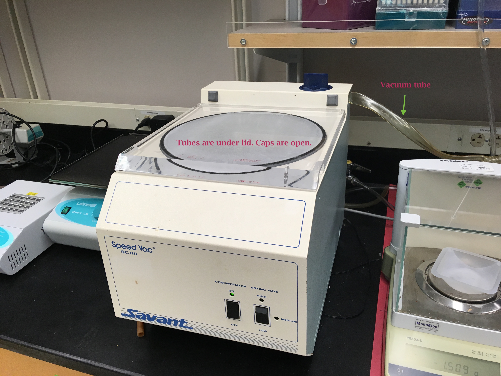
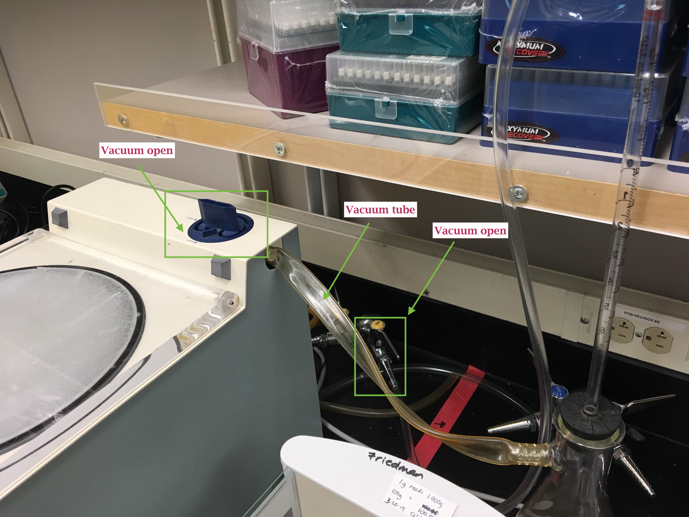
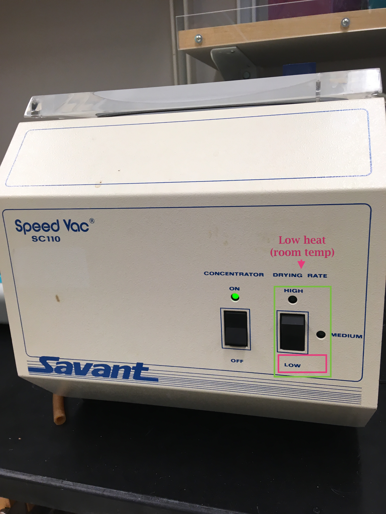
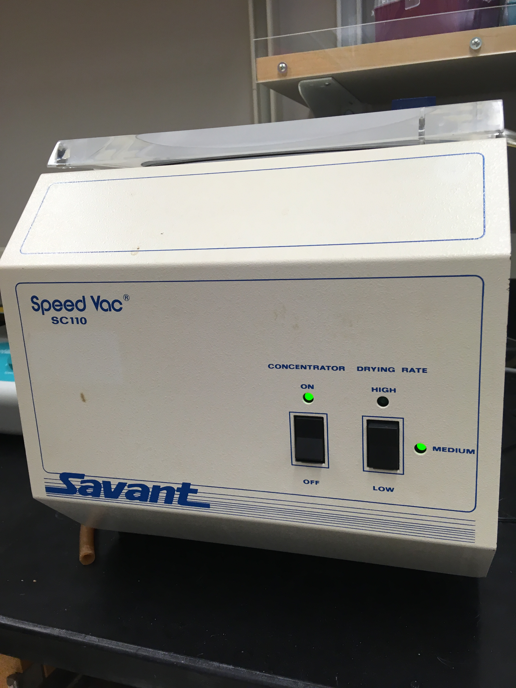

CRAB RNA POOLS: Today I started using the Speed Vac on the three pools with Sam. They were running on low temperature from 10:30am to 1:15pm. Not much liquid had evaporated. From 1:15pm-3:15pm they were run on medium temperature. Still not enough liquid has evaporated, so Sam will put them in the Speed Vac when he gets to FTR tomorrow morning. SKYLINE: I tested out the tutorial that the people from Skyline suggested I try out. Not sure how it turned out honestly, but Emma said she can take a look at it with me tomorrow.

## Speed Vac
### **Started at 10:30am on low temperature (room temperature)**      

### **Checked at 1:15pm. Still too much volume. Increased temp to medium**

### **Checked on it at 3:15pm. Still too much volume**     
Sam offered to put it back in the Speed Vac at medium temperature tomorrow morning when he gets in to FTR. It will hopefully be done by lab meeting. Because there is some precipate in the tubes (precipitate could be salts from the RNA isolation process or un-dissolved RNA), we will mix and Qubit the pooled tubes to get an accurate RNA concentration reading and then adjust the volume for the pools if need be. The CORE facility needs _**"RNA normalized to a minimum of 20ng/uL with a total volume of 50uL."**_ (GitHub Issue [#184](https://github.com/RobertsLab/resources/issues/184))

## 2015 Oysterseed Project: Skyline trouble-shooting
My error rates from [Step 5b](https://github.com/RobertsLab/resources/blob/master/protocols/DIA-data-Analyses.md#step-5b-spot-check-peptides) of the [DIA Protocol](https://github.com/RobertsLab/resources/blob/master/protocols/DIA-data-Analyses.md#step-5b-spot-check-peptides) were around or above 50% every time I tried it. Emma prompted me to contact the Skyline Support with my issue. 

I [wrote on their support page](https://skyline.ms/announcements/home/support/thread.view?rowId=36981) and they responded that I might try their Advanced Peak Picking in Skyline. I tried out their [tutorial](https://skyline.ms/_webdav/home/software/Skyline/@files/tutorials/PeakPicking_2-5.pdf) today with their example files. They don't have very detailed instructions in the DIA section.

Emma offered to go through it with me either tomorrow after Sam's birthday lunch or next week when I come back from my CA trip. 
