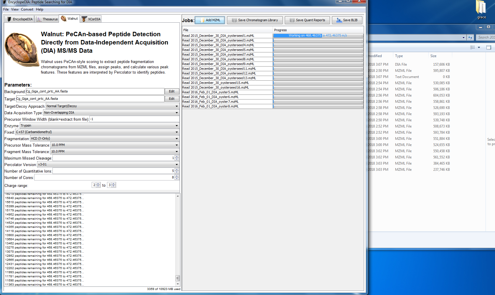

Today I started using Walnut (upgraded PECAN) to create a new BLIB file for the 2015 Oysterseed project. Hopefully this will improve the error rates in Skyline. Also, I called Pam to work on the NPRB progress report. Additionally, I detail Sam's updates on the status of the Crab pool samples from his [notebook post](http://onsnetwork.org/kubu4/2018/07/19/rna-cleanup-tanner-crab-rna-pools/). The RNA needs some cleaning so he suggests trying RNeasy Cleanup Kit. I will wait until he returns Monday and speak in person with him and Steven to figure out what to do next. 

## Walnut
Walnut is an upgraded PECAN and is used to create the BLIB file which I will use in my [DIA analysis](https://github.com/RobertsLab/resources/blob/master/protocols/DIA-data-Analyses.md) of the [2015 Oysterseed RAW files](http://owl.fish.washington.edu/phainopepla/C_gigas/2015-12-30/) in Skyline. 

I converted the RAW files to mzML using MSConvert. Then, I uploaded those files to Walnut. Will take a long time so I'll leave them alone and come back to them tomorrow morning.       

## NPRB Progress Report
I called Pam this morning to go over the progress report which is due by July 31st (Tuesday). Unfortunately we'll have to change/add some things to it regarding the issue with the current pools as detailed in my previous notebook post: [Crab Pools and Skyline Update](https://github.com/grace-ac/grace-ac.github.io/blob/master/_posts/2018-07-18-Crab-pools-pt-2-Skyline.md). My post is from right before I left for a little vacation to visit family. So, Sam tried to take a closer look at what is going on.

Here's his post: [RNA Cleanup - Tanner Crab RNA Pools](http://onsnetwork.org/kubu4/2018/07/19/rna-cleanup-tanner-crab-rna-pools/)

Essentially he used the RNeasy Plus Mini Kit (Qiagen) on the three pools. Then he ran Qubit and Nanodrop1000 with the three pools. The results were similar to what he and I found the day before in that they were not good. The Nanodrop did not detect RNA in the pools. The Qubit didn't detect RNA in Pool 1, and had very low numbers (~84ng of RNA in each pool) for pools 2 and the MasterPool. 

Our target for sequencing is to have 1000ng of RNA in each pool, which total volumes of 50 ul. We are not there. 

So, Sam is thinking of potentially having us try using RNeasy cleanup kit on some "test" samples to see if we can get better Qubit readings. 

I am gonig to talk about this on Monday with Sam and Steven in person. I will either have Pam call in or update her later. And we'll have to update the progress report, and I'll have to do more labwork to try to figure out why these numbers are so low and how we can get these pools to where we need them to be. Stay tuned... 
