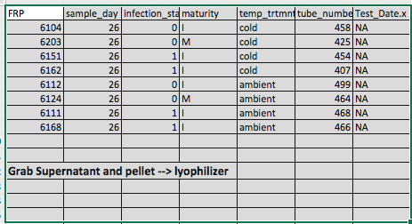
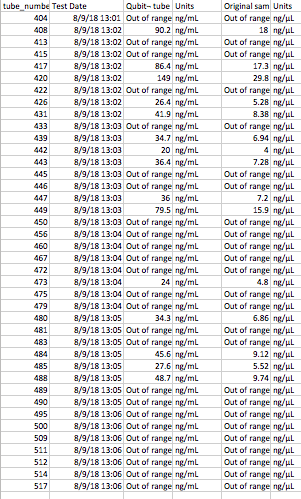

Today I met with Steven and Sam to make a new plan for the crab RNA problem. We're going to use the lyophilizer (freeze drying machine that goes below -80˚C) on 8 new pelleted hemolymph samples from Day 26; 8 supernatant samples that correspond to those 8 pelleted; and a pooled sample of all the ones Sam processed using the Qiagen RNeasy Kit that had "out of range" Qubit results. This will have to be post-poned for a bit becuase the lyophilizer is currently being fixed... waiting for an ETA on that. In regards to Skyline, I re-visited what I did before I left for vacation and went through all the files used and settings chosen. I put all of the information in a new GitHub issue per Steven's request. 

## Crab RNA
Sam processed the 40 samples that I picked out from Day 26 (samples taken in triplicate) using the Qiagen RNeasy Kit. 15 of the 40 had detectable RNA with the Qubit. Here is a link to his notebook post: [RNA Isolation & Quantification - Tanner Crab Hemolymph](http://onsnetwork.org/kubu4/2018/08/09/rna-isolation-quantificaiton-tanner-crab-hemolymph/).

Steven, Sam, and I talked a little before lab meeting to come up with a new game plan. I picked out 8 more samples (2 from each treatment group from day 26 except for the warm). I pulled out the pelleted hemolymph as well as the supernatant (RNAlater) that may have some cells in it.        

I also pooled together all of the samples that Sam processed that had "out of range" Qubit results.        

THe plan (once the Lyophilizer is fixed/ if it is fixed) is to put the samples in the lyophilizer (freeze dryer) overnight, then try out the Tri-reagent protocol on the 8 pelleted and 8 supernatant samples. I will re-quanitifiy the pooled sample using the QUbit.

Based on what happens with that, we'll decide what else to do going forward. But we want to send off a tube for sequencing ASAP so that we can get things moving. 

## Skyline DIA 
I made a GitHub issue ([#341](https://github.com/RobertsLab/resources/issues/341)) detailing the issues I've had since using Walnut to make the new BLIB file. Assigned Emma to the issue and am awaiting her response. 
