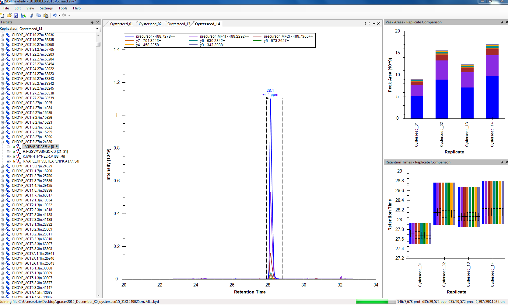
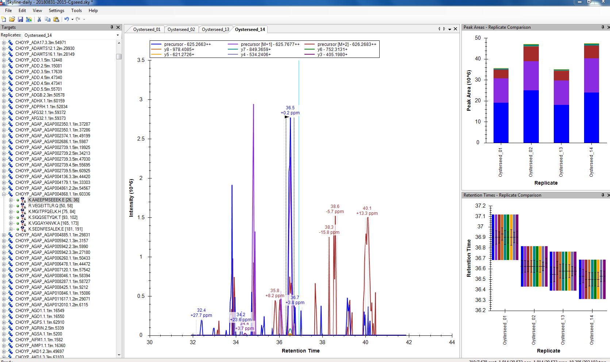
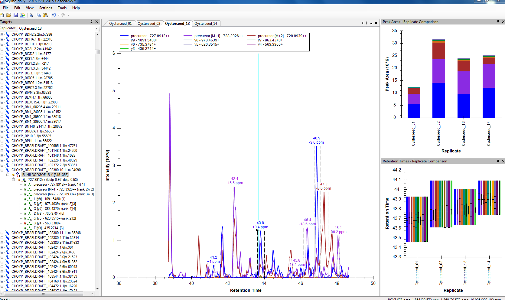
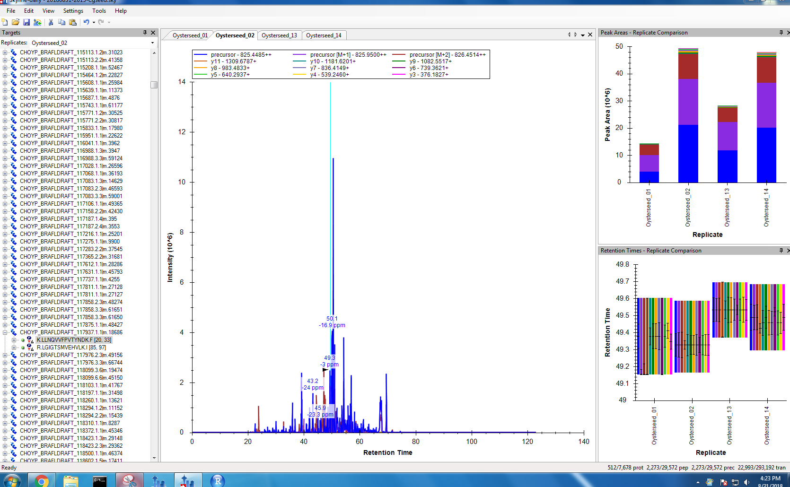

Today I re-tried the Skyline DIA 2015 Oysterseed protocol. Emma has been pretty busy teaching her course these past several weeks and hasn't been able to get back to me on my GitHub issue ([#341](https://github.com/RobertsLab/resources/issues/341)). I re-did the protocol using the same files and quadruple checking all the settings. Things still look mediocre. I'll post the new .zip to today's file on the GitHub issue so she can take a look at it when she has time. 

I followed the same old [DIA protocol](https://github.com/RobertsLab/resources/blob/master/protocols/DIA-data-Analyses.md), but also did the new setting that Emma suggested as well as double-checked I was using the same files I used to make the BLIB file in Walnut as the results, as detailed in my post from [July 27, 2018](https://grace-ac.github.io/Skyline-DIA/). 

New zip: [20180831-Cgseed](http://owl.fish.washington.edu/scaphapoda/grace/2015-oysterseed-project/20180831-2015-Cgseed.sky.zip)

I clicked through about 20 peptides to see what they looked like, and there's a mixed bag, however most are very noisy with no clear peak. 

This one is pretty good and clean, but quite low intensity (y-axis):      

This one has a lot of noise:    

As does this one:    

And this one is just bad. Many were like this:     

I'm curious as to what will be done to fix/move on with this. I don't understand the Advanced Peak Picking Method, as it is not hashed out, but I am hoping to get to the point where I can start analyzing the data before school starts 9/25/18. 
