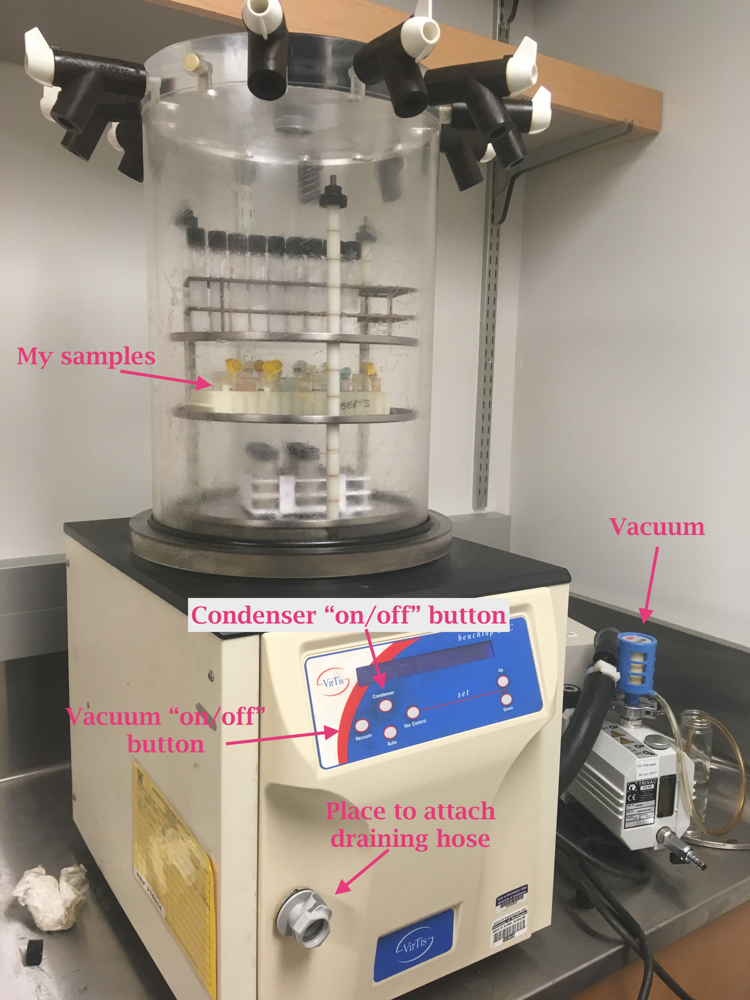

Today I started using the lyophilizer on the samples I picked out (pellet and supernatant) and the pooled sample of the ones from Sam's Qiagen RNeasy extraction that had "Out of range" Qubit results. 

## Lyophilizer
Start: 10:45am 09/10/18       
Samples:      
**pooled sample of the ones from Sam's Qiagen RNEasy extraction that had "out of range" Qubit results**     
**AND**        
     
   
Lyophilizer setup:    

In order to use (there are instructions on how to use that are posted in the room):     
- make sure that the condenser (inside the machine- visible when you remove the cylindrical container and the cover) is dry
- turn on condenser
- wipe off all the old grease on the rim of the opening to the condenser and the black tube 
- Add new grease to the rim and the black tube
- place the cover, the rack with samples on it, and the cylindrical container with the black rubber tube along the bottom 
- make sure all of the valves on openings at the top of the cylindrical container are vertical (lined up with the black notch)
- Once the condenser gets below -70 C, turn on the vacuum

Megan Feddern (Holtgrieve Lab) helped me with all of this today and tomorrow she'll show me how to take out my samples. She is sharing the lyophilizer with me. 
