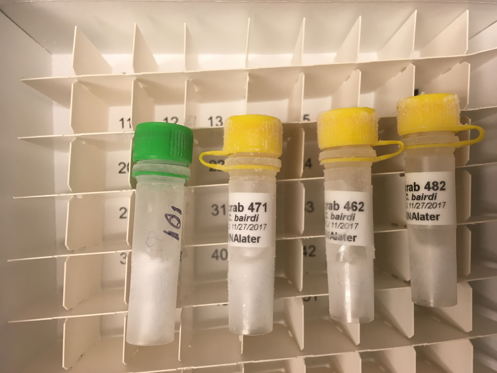
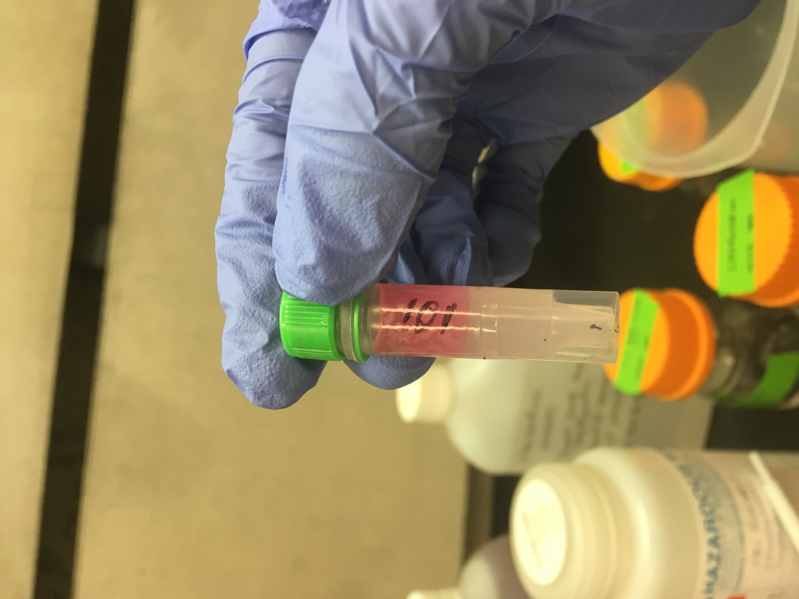
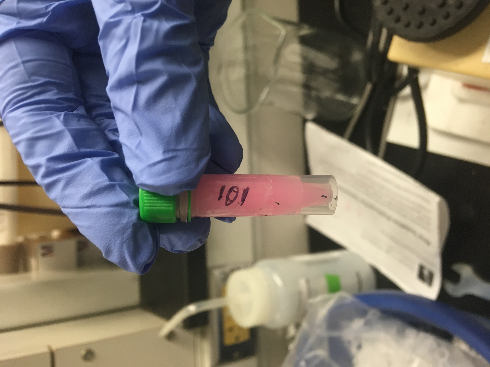
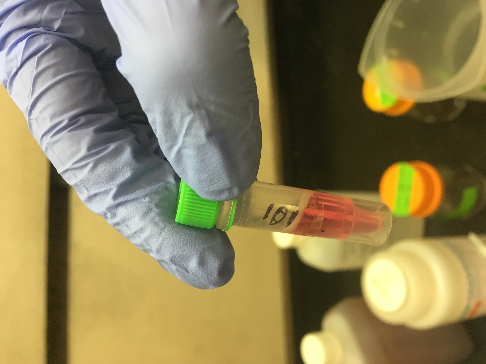
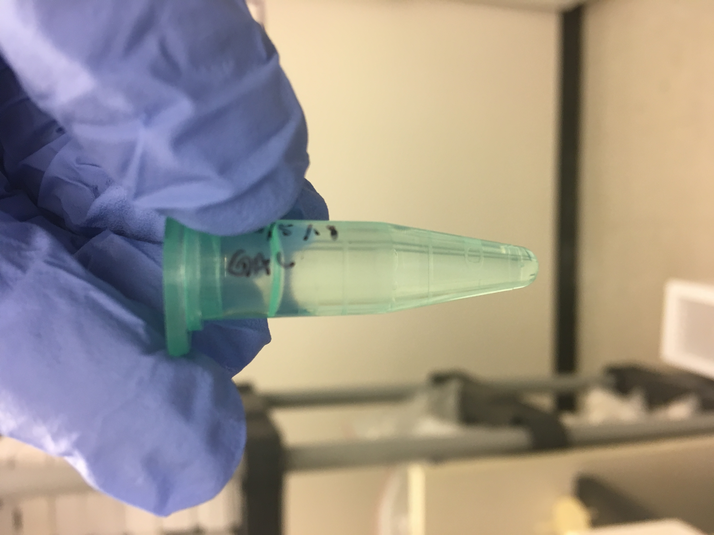
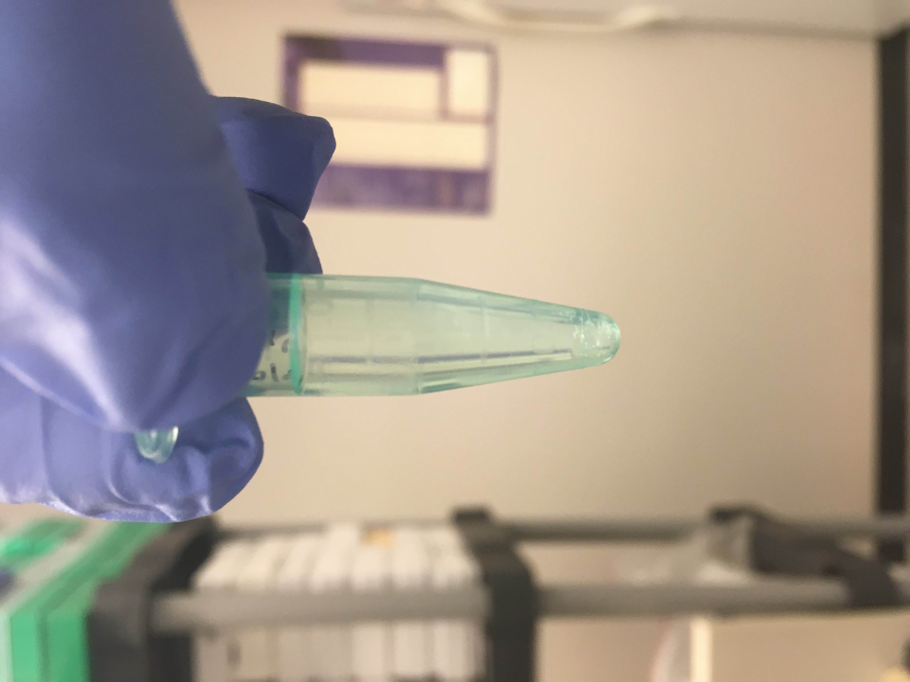
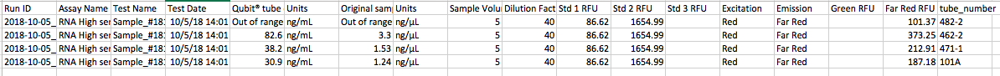
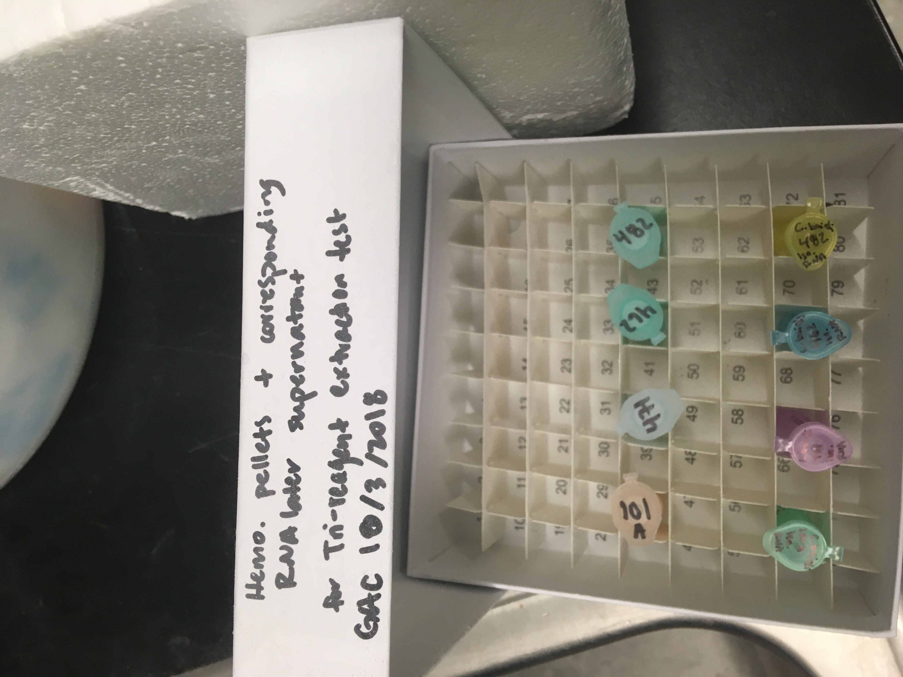

Today I extracted RNA from four practice samples using Tri-reagent, and without lyophilizing (lyophilizer is out of commission again for now). 

## Tubes I used:    

101-A --> a mistake sample        
471-1 --> Day 26, uninfected, ambient        
462-2 --> Day 26, infected, ambient        
482-2 --> Day 26, infected, ambient         

# Protocol (from Tri-reagent protocol in [Sam's notebook](http://onsnetwork.org/kubu4/2018/09/17/3558/))

1. Added 1mL TriReagent to each tube             
2. vortexed to mix/dissolve solute             
       

3. incubated 5mins at RT       
4. added 200uL of chloroform, pipet and then vortexed 15s to mix        
          
5. incubated at RT for 5mins           
6. centrifuged 15mins, 12,000g, 4˚C        
         
7. transferred aqueous phase to new tube         
8. added 500uL isopropanol to aqueous phase        
9. mixed, incubated at RT for 10mins         
10. centrifuged 8mins, 12,000g, at RT        
       
11. discarded supernatant       
12. added 1mL 75% ethanol      
13. centrifuged 5mins, 12,000g at RT      
      
14. discarded supernatant      
15. resuspended in 10uL of 0.1% DEPC-treated H2O.  

[Qubit Results](http://owl.fish.washington.edu/scaphapoda/grace/Crab-project/Qubit/QubitData_2018-10-05_14-01-52.csv) (5ul of sample):      

## The extracted RNA tubes live in Rack 5, Column 4, Row 3     
     

# I did not do anything with the supernatant. I only process hemolymph pellet samples today.    

## Thoughts on the protocol:     
- At step 14, tube 482 was really difficult to discard the supernatant. THere was stringy, clear material that was difficult to avoid, so I wasn't able to discard a lot of the 75% ethanol. In the other tubes, however, the stringy stuff was more or less easier to avoid and I was able to remove almost all of the 75% ethanol before resuspending the sample in 0.1% DEPC-treated H20.     
- The aqeous phase was really apparent with the Trizol, which I never saw when I used the RNAzol. Using the RNAzol always ended up being that the blue RNAzol was either at the top of the tube, the middle/bottom, or sometimes even throughout the tube. This, in all four tubes, created a clearly defined aqeous phase, which made removing the aqeous phase so so easy.
- Even though the Qubit results were pretty good, as I have learned from my RNAzol situation this summer, I cannot trust it until I look at the samples on the Bioanalyzer!!
