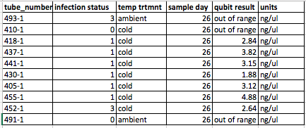
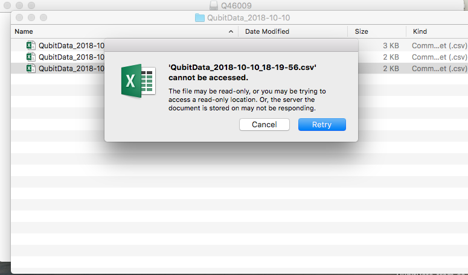
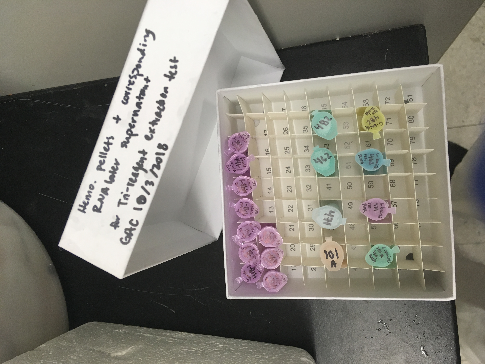

Today I extracted RNA from 10 samples from Day 26. These still had all three samples in the box, so they are all ###-1 tubes. The QUbit wouldn't let me download the data from the USB. I'm not sure why, but luckily I wrote down, as I always do, the reads for each tube number. Out of the 10, 7 had quantifiable RNA by the RNA HS Qubit. 

# Samples used:     
    

# Tri-reagent extraction protocol 

1. Added 1mL TriReagent to each tube
2. vortexed to mix/dissolve solute
3. incubated 5mins at RT
4. added 200uL of chloroform
5. vortexed 15s to mix
6. incubated at RT for 5mins
7. centrifuged 15mins, 12,000g, 4oC
8. transferred aqueous phase to new tube
9. added 500uL isopropanol to aqueous phase
10. mixed, incubated at RT for 10mins
11. centrifuged 8mins, 12,000g, at RT
12. discarded supernatant
13. added 1mL 75% ethanol
14. centrifuged 5mins, 12,000g at RT
15. discarded supernatant
16. resuspended in 10uL of 0.1% DEPC-treated H2O.

# Thoughts from today's extraction:   
- It was more difficult to see any RNA at the bottom of the tubes in the end. Friday was a lot easier.
- One of the 10 tubes did not have a clear aqueous phase separation. I had to remove some of the pink off the top, then attempt to just get the clear liquid beneath that and above the rest of the pink. I did not write down which tube it was, so I'm not sure which Qubit result belongs to it. 

# Difficulty getting Qubit data off of the USB    

I re-downloaded the data on the Qubit a second time, but still I couldn't download it from the USB. I kept getting the same error, and I would retry multiple times, but still wasn't able to get it. I do need that data so that I can add it to my sampling master spreadsheet!

# Need to do bioanalyzer on these 10 samples
I ran out of time today - I have to go pack and get some other things done before I leave tomorrow. May ask someone else to bioanalyze, or I'll do it myself when I return next week.

The samples are in purple tubes in Rack 5, Column 4, Row 3:    

---
Qubit results from today (got off the USB 10/19/18)    
[here](http://owl.fish.washington.edu/scaphapoda/grace/Crab-project/Qubit/QubitData_2018-10-10_18-19-56.csv)
