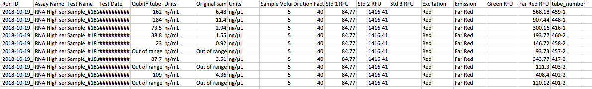

Today I extracted RNA from 10 more pelleted hemolymph samples using Tri-Reagent (without lyophilizing). I ran 5 ul on the RNA HS Qubit, and 7/10 had quantifiable RNA. I also started working with the .fastq sequence data from our first sequenced library. I ran the four files through FASTQC and am learning how to determine if the output is good.

### RNA Isolation

Today I isolated the following samples using the protocol outlined [here](https://github.com/grace-ac/grace-ac.github.io/blob/master/_posts/2018-10-10-Tri-reagent-extraction_protocol.md).

[Qubit results](http://owl.fish.washington.edu/scaphapoda/grace/Crab-project/Qubit/QubitData_2018-10-19_13-22-52.csv):    

70% success is not bad! 

On Monday, Steven, Sam, and I are going to discuss how to move forward. The [Bioanalyzer results](https://github.com/grace-ac/grace-ac.github.io/blob/master/_posts/2018-10-08-R-plans-Bioanalyzer-results.md) from the first time I extracted RNA using Tri-reagent and not lyophilizing did not look great, so we'll have to see how to proceed. The lyophilizer is still broken. 

### Starting to work with .fastq data

We received notice on Oct. 15th that our data from our [first library](https://grace-ac.github.io/Pooled-sample-handed-toNWGC/)!

Sam did some [work with it](http://onsnetwork.org/kubu4/2018/10/15/data-received-chionoecetes-bairdi-rnaseq-fastqc-analysis/), but I'll be replicating some of it before I continue on. Currently, I'm working on running the [four .fastq files](http://owl.fish.washington.edu/nightingales/C_bairdi/) through FASTQC. 

Here are url's to my output files:    
[http://htmlpreview.github.io/?file:///Users/graciecrandall/Downloads/304428_S1_L001_R1_001_fastqc/fastqc_report.html](http://htmlpreview.github.io/?file:///Users/graciecrandall/Downloads/304428_S1_L001_R1_001_fastqc/fastqc_report.html)          
[http://htmlpreview.github.io/?file:///Users/graciecrandall/Downloads/304428_S1_L001_R2_001_fastqc/fastqc_report.html](http://htmlpreview.github.io/?file:///Users/graciecrandall/Downloads/304428_S1_L001_R2_001_fastqc/fastqc_report.html)             
[http://htmlpreview.github.io/?file:///Users/graciecrandall/Downloads/304428_S1_L002_R1_001_fastqc/fastqc_report.html](http://htmlpreview.github.io/?file:///Users/graciecrandall/Downloads/304428_S1_L002_R1_001_fastqc/fastqc_report.html)          
[http://htmlpreview.github.io/?file:///Users/graciecrandall/Downloads/304428_S1_L002_R2_001_fastqc/fastqc_report.html](http://htmlpreview.github.io/?file:///Users/graciecrandall/Downloads/304428_S1_L002_R2_001_fastqc/fastqc_report.html)        

I will be using this data for my [FISH546 project](https://github.com/fish546-2018/grace-Cbairdi-transcriptome). 

#### Some things I learned today/next steps notes:    
- There are so many files in [/nightingales/C_bairdi/](http://owl.fish.washington.edu/nightingales/C_bairdi/) even though it is from 1 pooled sample because the sample was run in two lanes, and there was a reverse and a forward run. 
- Next steps after FASTQC:   
      - Combine files into one (concatenate)
      - Trim (if necessary)
      - Assemble

This weekend and Monday I'll play around with Trinity. Tuesday in FISH546 class we'll go into the details of the FASTQC output to see what they mean. 

