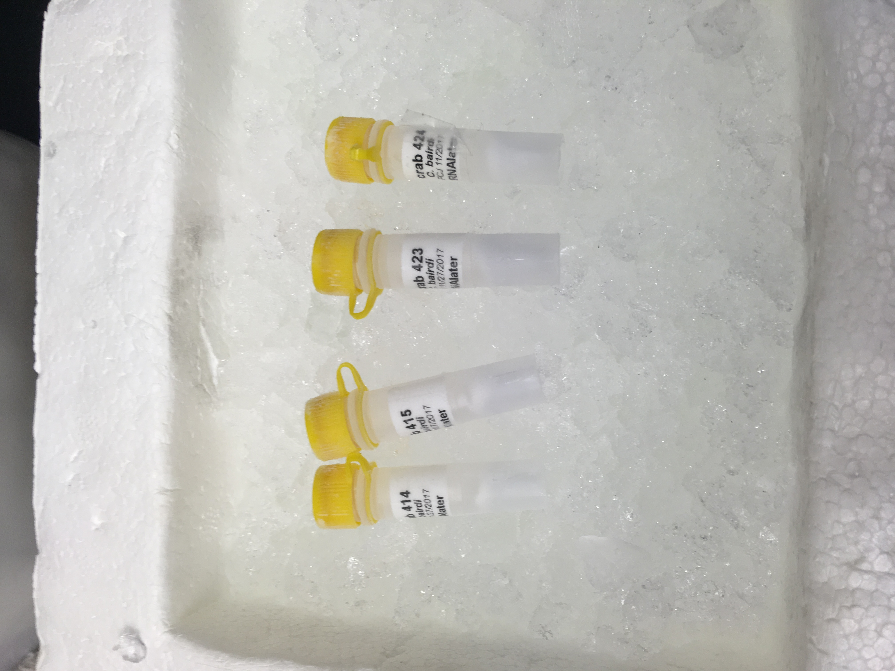
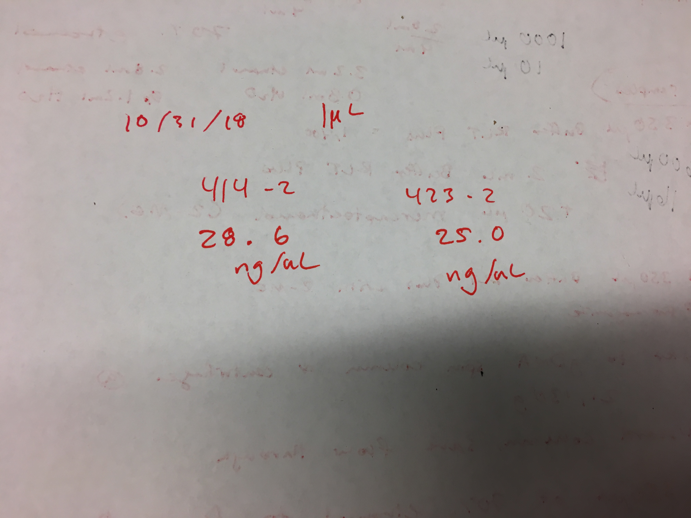

Today I ran BLAST with the bad fasta from the Trinity run from last weekend. Will look more at the notebook Steven sent me to do the BLAST stats, goslim, contigs, go slim tables, etc. I also have been getting some input from Sam as to how best to manage adding new Qubit data to a master file consisting of all the hemolymph sampling data joined with the Qubit data results. Finally, I tested out the RNeasy Plus Micro Kit on 4 samples from Day 26, and ran the Qubit. 

## BLAST
[BLAST test notebook](https://github.com/fish546-2018/grace-Cbairdi-transcriptome/blob/master/notebooks/20181025-blast-Cbairdi_swiss-prot.ipynb)

I had to get some help because my original notebook wasn't working because I had a SPACE after one of the lines, and I guess Jupyter can't handle that. ([GitHub Issue # 461](https://github.com/RobertsLab/resources/issues/461)). 

Here is what the head of the BLAST looks like:     


I'll look at [this notebook](https://github.com/sr320/nb-2018/blob/master/C_virginica/83-blast-2-slim.ipynb) of Steven's to do the goslim, contigs, etc. 

This process will help me identify a workflow and pipeline for once my most recent Trinity output is available.

## R Plan
I've been having trouble with finding a relatively simple and reproducible way of adding new Qubit data to my hemolymph sampling data. 

The new general plan, as recommended by Sam ([# 460](https://github.com/RobertsLab/resources/issues/460)), is as follows:    
```
The order of operations for all of this should look something like this (all in R):

Transfer Qubit CSV from Qubit USB drive to repo.

Use sys() function to use bash command to format to UTF CSV and strip header.

Use R to insert tube_number column and corresponding tube numbers for each sample and write to CSV.

Use sys() function to use bash to concatenate all UTF CSVs into master UTF CSV.

Use sys() function to use bash to restore header to master UTF CSV.

Do all your downstream manipulations using fully formatted master UTF CSV.

You can probably do a bunch (i.e. all) of this stuff using straight R, without needing to use the sys() function, but I don't know how and I do know that the sys() bash stuff is definitely needed for UTF conversion.

Additionally, you should have (at least) two scripts

Script for creating master UTF CSV.

Script for all other downstream stuff involving master UTF CSV.
```

Here is the start of that in the [project-crab/scripts](https://github.com/RobertsLab/project-crab/tree/master/scripts) directory. 

I'm still trying to wrap my head around the flow of things and still have to figure out how to do the bash script in R. Previously, I just did it in terminal, and then had that new UTF csv transferred to [Qubit_data](project-crab/tree/master/data/Qubit_data) directory in my project-crab repository.

## RNeasy Plus Micro Kit test

I tested the protocol out on 4 samples from Day 26 (tubes 2 out of 3):      


I used the protocol ([page 1](https://github.com/grace-ac/grace-ac.github.io/blob/master/notebook-images/IMG_3991%202.JPG) and [page 2](https://github.com/grace-ac/grace-ac.github.io/blob/master/notebook-images/IMG_3992.JPG)) provided in the box. 

Some changes that were made were based on [Sam's notebook post](http://onsnetwork.org/kubu4/2018/08/09/rna-isolation-quantificaiton-tanner-crab-hemolymph/). 

Since I did 4 samples, I added 16 µL of 2-ME to 1600 µL of Buffer RLT Plus.     
I didn't understand what to do with the QIAshredder columns, so I didn't use them.

Some things that happened:    
Everything went well in general, I think. Once I had all the materials gathered, it was pretty easy to follow to protocol and it was quick.

However, during the drying out step (Step 8), the caps of the RNeasy MiniElute caps snapped off for samples 415-2 and 424-2. So, I ended up tossing them for the final step because the lid of the 1.5mL collection tube didn't fit. 

I ran the Qubit on the two samples that made it: 414-2 and 423-2.    
The samples were eluted in 14 µL of RNAse-free water, and I used 1µL of the samples two quantify on the qubit. 

The results are as follows:   




These results are pretty good! Just want to check on bioanalyzer and/or Nanodrop.

Will discuss next steps at Crab meeting tomorrow morning. 


