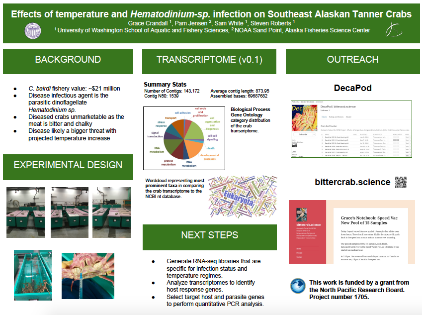

Today at 4:25pm, I submitted my poster to be printed for GSS, which is tomorrow... Steven helped a lot with picking out what information would be interesting to include. My goals for Thursday and Friday include both the Crab Project and the 2015 Oysterseed Project.

### GSS Poster
Google slides link to poster: [here](https://docs.google.com/presentation/d/1-He0BVrmAMimUYiD6FxQGc7UmTgpdLgXLUst1XTKQxo/edit)     

I made the pie chart in excel really quick with this file: [Blastquery-GOslim-sep.csv](http://owl.fish.washington.edu/scaphapoda/grace/Crab-project/Blastquery-GOslim-sep.csv), which is the output file with columns tab delimited [using R](https://github.com/fish546-2018/grace-Cbairdi-transcriptome/blob/master/scripts/plots.R) from this python notebook: [11052018-C_bairdi-blastn.ipynb](https://github.com/fish546-2018/grace-Cbairdi-transcriptome/blob/master/notebooks/11052018-C_bairdi-blastn.ipynb).

To make a poster, you can use google slides and set the dimensions to 48in w x 36 in h (File > Page Setup > Custom > adjust dimensions.

Then, you export the slide as a PDF, and send it to [UW Creative Commons](https://finance.uw.edu/c2/posters). 

### Goals for the rest of the week:  
2015 Oysterseed:     
- mprophet model in Skyline (notes from Emma)

Crab Project:  
- Make extraction plan for other libraries (get input from Sam and Steven)
- Extractions
- R script for adding new Qubit data 
