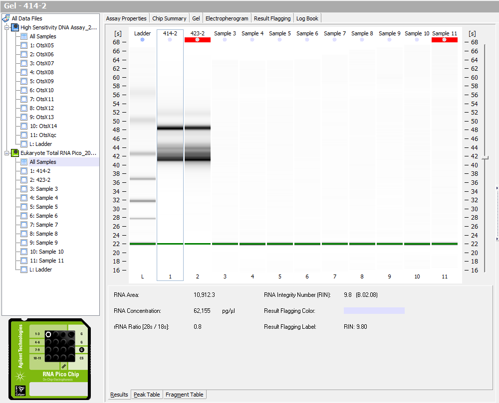
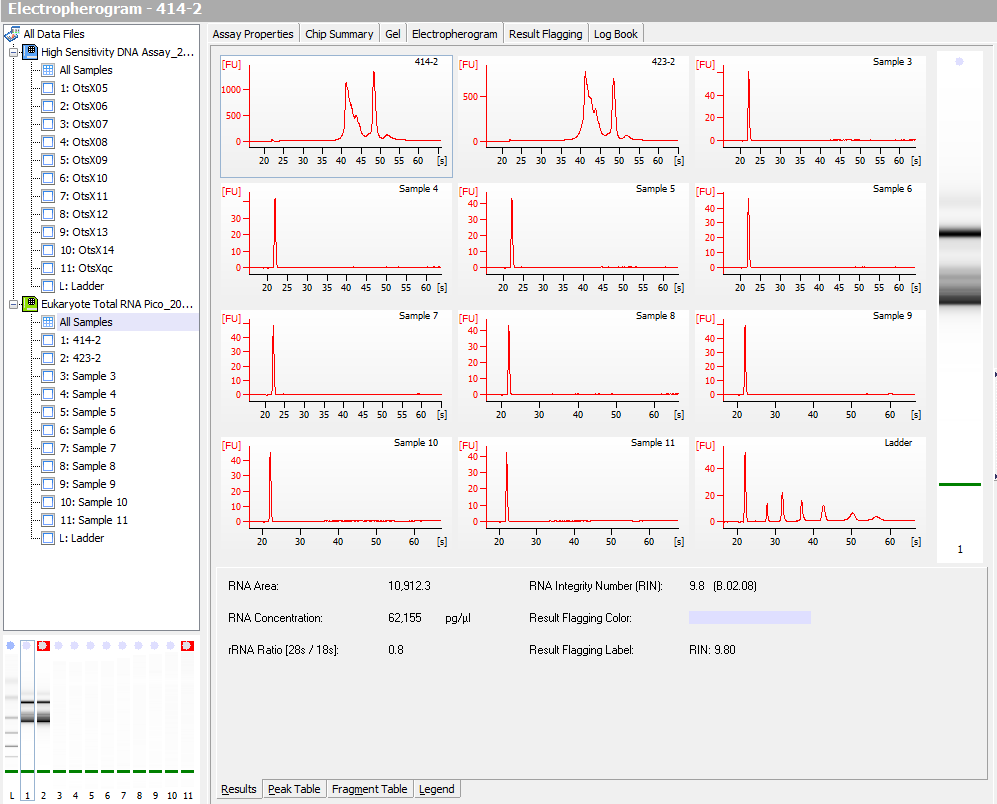

Today I ran the two samples from Day 26 that I extracted using RNeasy Kit on the Bioanalzyer. The results look pretty good and we can now make a library and see how it goes. 

### Results

They don't have the same band pattern as [Sam's samples](http://onsnetwork.org/kubu4/2018/08/01/bioanalyzer-tanner-crab-rna-isolated-with-rneasy-plus-mini-kit/), possibly due to degradataion, but they look okay...?

These samples were from [Oct. 31st](https://grace-ac.github.io/BLAST-R-and-RNeasy-test/). 

