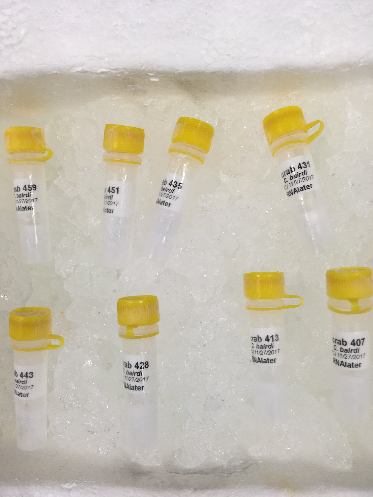
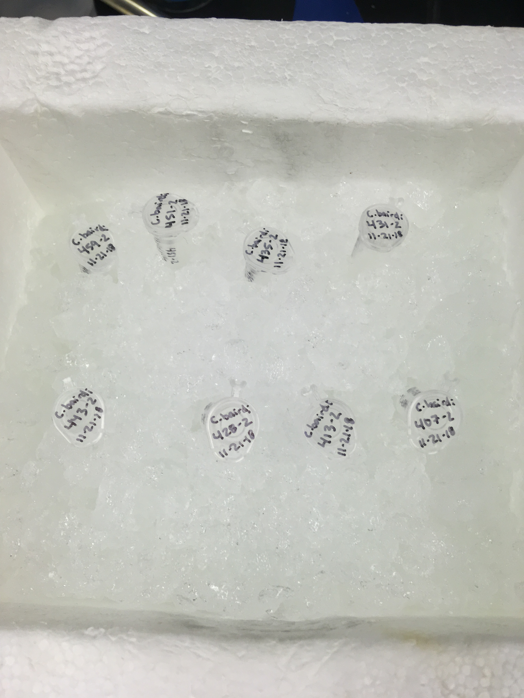
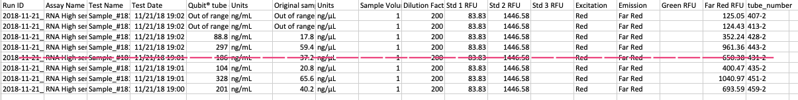

Today I edited and published S1E13 of DecaPod. In this episode I interview Madi Shipley (MS, SAFS) who works with Bering Sea Tanner crabs. I also extracted RNA from 8 samples (all Cold, infected, Day 26) using Qiagen RNeasy and definitely have enough RNA for a pool!

## DecaPod
[S1E13 posted](https://bittercrab.wordpress.com/category/podcast/)

## RNeasy Extraction: 8 samples D26, cold, infected

Today I extracted RNA from 8 samples (all the second out of the three that were taken per crab):      

I used the RNeasy protocol, with a few modifications:    
- At steps 5-7, I centrifuged at 10,000 rcf
- Added 2-ME to Buffer ATL (since 8 samples, did 3mL buffer, 30µL 2-ME)
- Did _not_ add RNA carrier
- Eluted with 14µL water (provided in Kit)

Qubit results look pretty amazing! My [bioanalyzer results](https://grace-ac.github.io/Bioanalyzer-RNeasy-results/) from last time looked pretty good, so I think we can trust these results. EXCEPT for tube number 413-2 because some of the working solution did not make it into the qubit tube.      

The tubes (now with 13µL of material) are in Rack 5, Column 4, Row 3 in the -80. 

NWGC wants 20ng/µL of RNA in 50µL sample (GitHub issue [#184](https://github.com/RobertsLab/resources/issues/184)). It looks like we have more than enough! 

When I return from the short holiday break this weekend, I'll start picking out samples for the other pools and get feedback from Steven and Sam. 
