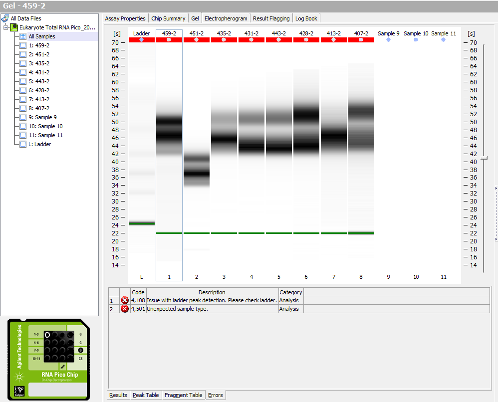
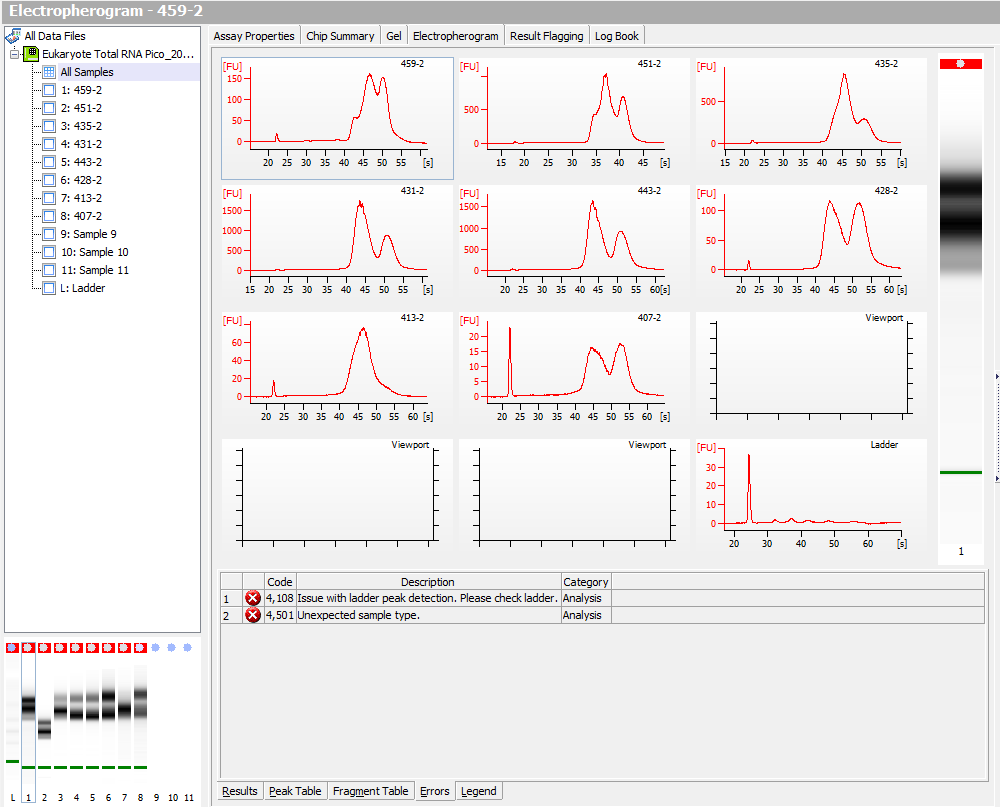

Today I ran the bioanalyzer on the batch of 8 samples from Day 26 (cold, infected) from [Nov 21st](https://grace-ac.github.io/Pool-RNeasy-DecaPod-S1E13/). Results don't look super great, and the ladder didn't show up. 

#### Gel

#### Electropherogram

[Eukaryote_Total_RNA_Pico_2018-12-14_12-48-07.xad](http://owl.fish.washington.edu/scaphapoda/grace/Crab-project/bioanalyzer-results/Eukaryote%20Total%20RNA%20Pico_2018-12-14_12-48-07.xad)

### Next steps: January 2019

We have ordered a new reagent ([TRIzol LS Regent](https://www.thermofisher.com/order/catalog/product/10296028)), and will tentatively have it next week (Tuesday/Wednesday). We'll extract some RNA from some samples with that reagent and compare to yields and purity that we get from the Qiagen Kit. 

