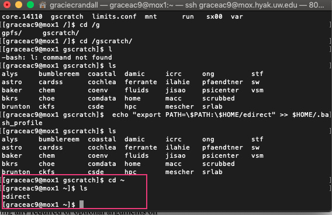
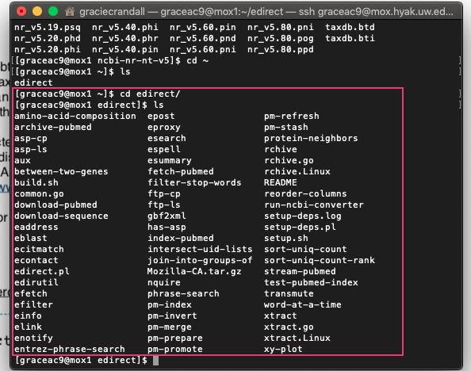

Today I'm trying to get started on the new BLAST +2.81 that has new databases and improved performance. This is pretty exciting because once I figure out how this works, I'll be able to easily get taxonomy information like Order, Class, etc. I'm attempting what I believe is the first step in this process: trying to get the taxid for "Decapoda". Details below of resources used and what I did. 

## New BLAST nt taxonomy: Step 1- trying to get Decapoda taxid
[BLAST +2.81 information](https://ncbiinsights.ncbi.nlm.nih.gov/2019/01/04/blast-2-8-1-with-new-databases-and-better-performance/)

[New BLAST taxonomy options](https://ftp.ncbi.nlm.nih.gov/blast/db/v5/blastdbv5.pdf)

Sam installed the new version on Mox:    
`/gscratch/srlab/programs/ncbi-blast-2.8.1+/bin`       
And the databases:   
`/gscratch/srlab/blastdbs/ncbi-nr-nt-v5`

Sam reccommends that each user installs the eDirect utilities in order to use the full taxid functionality.       
Instructions on installing eDirect: [here](https://www.ncbi.nlm.nih.gov/books/NBK179288/)

My eDirect directory (after installation) lives in my home directory on Mox:    


Contents of eDirect:     


The [new BLAST taxonomy](https://ftp.ncbi.nlm.nih.gov/blast/db/v5/blastdbv5.pdf) method starts with (this example was taken from the pdf):     

get_species_taxids.sh -n Enterobacterales

Taxid: 91347
 rank: order
 division: enterobacteria
 scientific name: Enterobacterales
 common name:
 
1 matches found

get_species_taxids.sh -t 91347 > 91347.txids

blastn –db nt –query QUERY –taxidlist 91347.txids –outfmt 7 –out OUTPUT.tab

#### So, if I'm understanding this correctly, I am going to:
1. run the first command:     
`get_species_taxids.sh -n Decapoda`

That will give me a taxid number, which I will:  

2. then use to create a file with the extension `.txids` that will contain the parts of the overall nucleotide taxonomy database that are included in that taxid number:     
`get_species_taxids.sh -t ##### > #####.txids`

3. Then, I'll perform a `blastn` with my query.fa (the assembled _C. bairdi_ transcriptome) against the taxid list (file with extension `.txids`) to find all of the proteins that are associated with Decapoda, and put it into an output file (extension `.tab`). 

#### Here's what I have currently in queue on Mox:     
```
#!/bin/bash
## Job Name
#SBATCH --job-name=get_species_taxid
## Allocation Definition
#SBATCH --account=coenv
#SBATCH --partition=coenv
## Resources
## Nodes (We only get 1, so this is fixed)
#SBATCH --nodes=1
## Walltime (days-hours:minutes:seconds format)
#SBATCH --time=4-00:00:00
## Memory per node
#SBATCH --mem=100
##turn on e-mail notification
#SBATCH --mail-type=ALL
#SBATCH --mail-user=graceac9@uw.edu
## Specify the working directory for this job
#SBATCH --workdir=/gscratch/srlab/graceac9/analyses/0115-get-species-taxids

# Load Python Mox module for Python module availability

module load intel-python3_2017

/gscratch/srlab/programs/ncbi-blast-2.8.1+/bin \
-get_species_taxids.sh -n Decapoda
-out 0115-get_species_taxid_decapod.txt
```

Not sure if this will actually do anything... but we'll see once Sam's job finishes.


#### In the meantime...
Crab:    
- Extract RNA using Trizol LS Reagent tomorrow, run on Qubit, Bioanalyze with Qiagen kit-extracted sampels

2015 Oysterseed:    
- Work on figures and paper (Emma is coming to lab meeting Thursday - I will only be able to be there 9:45-10:15)
