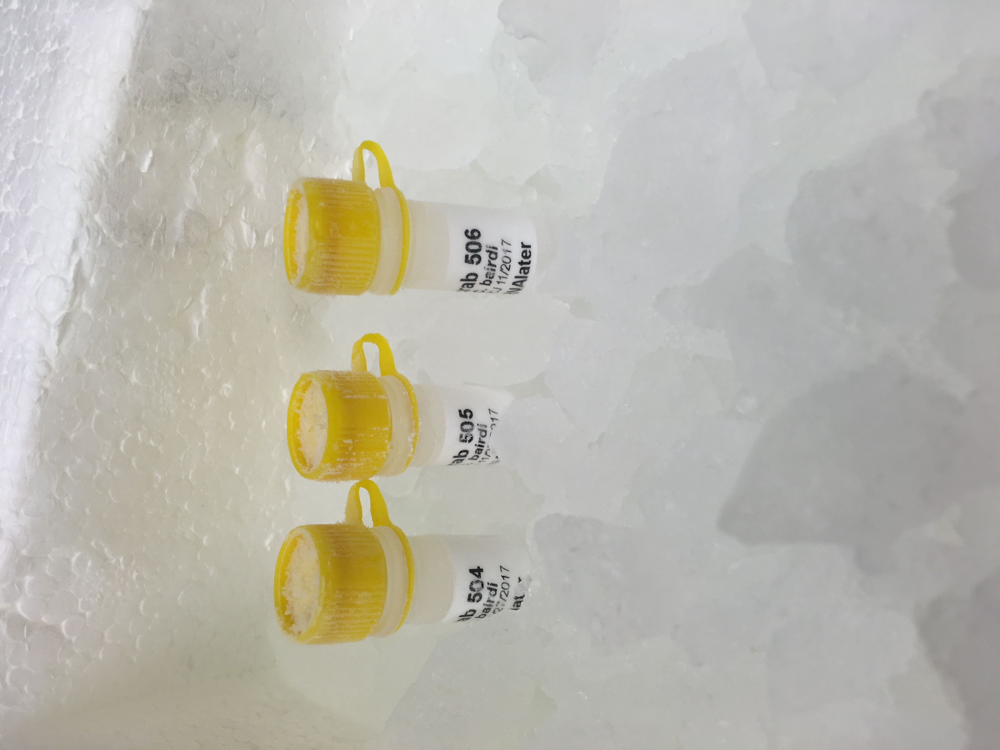
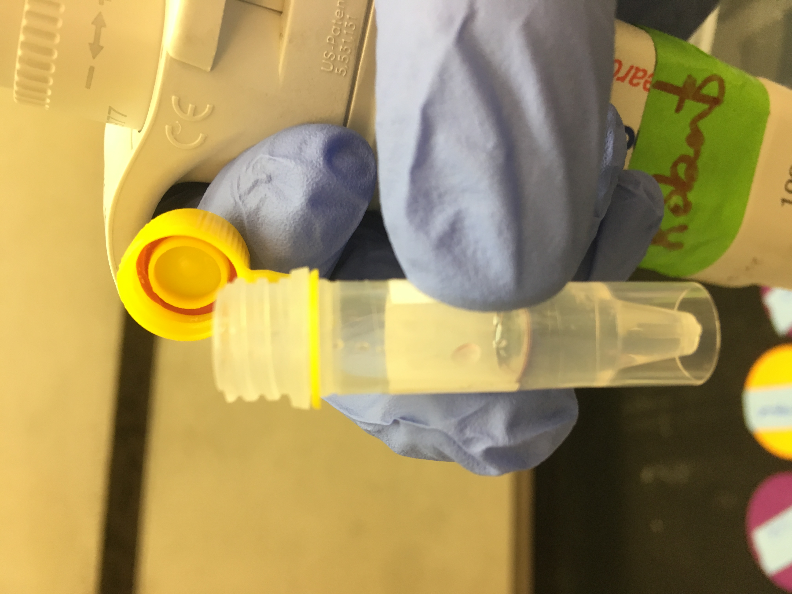
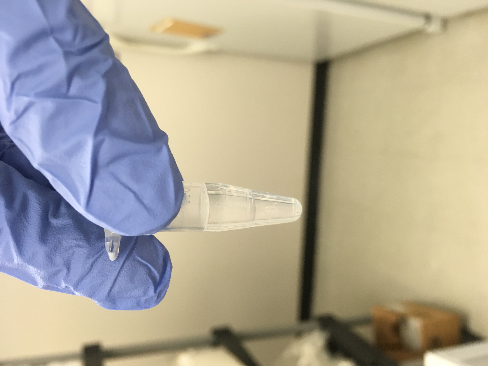
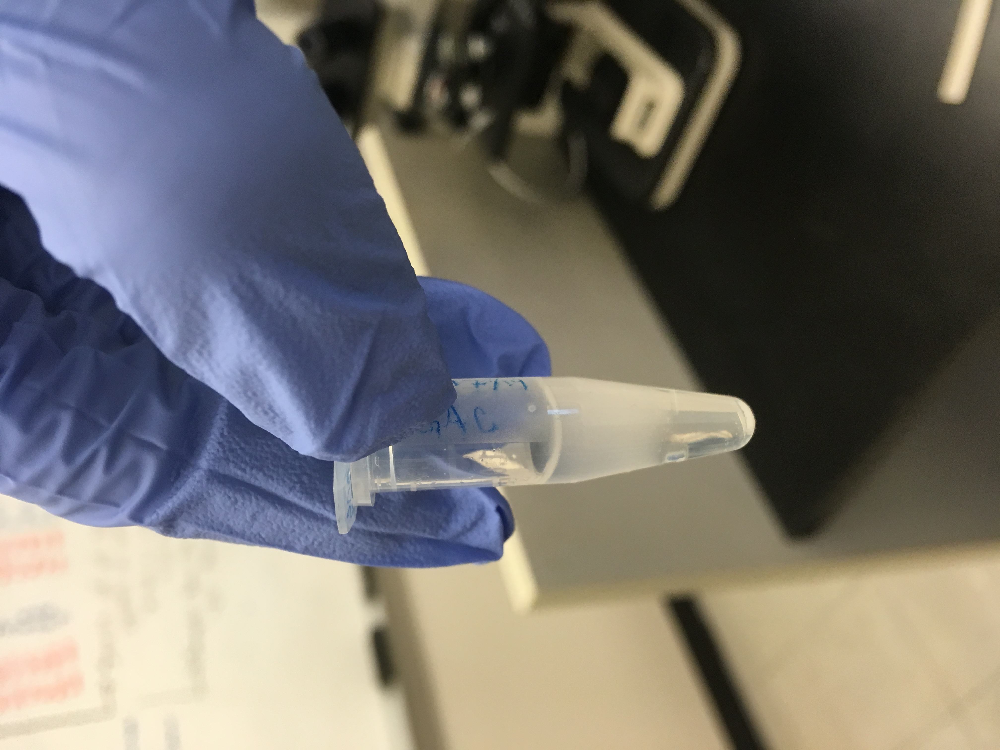
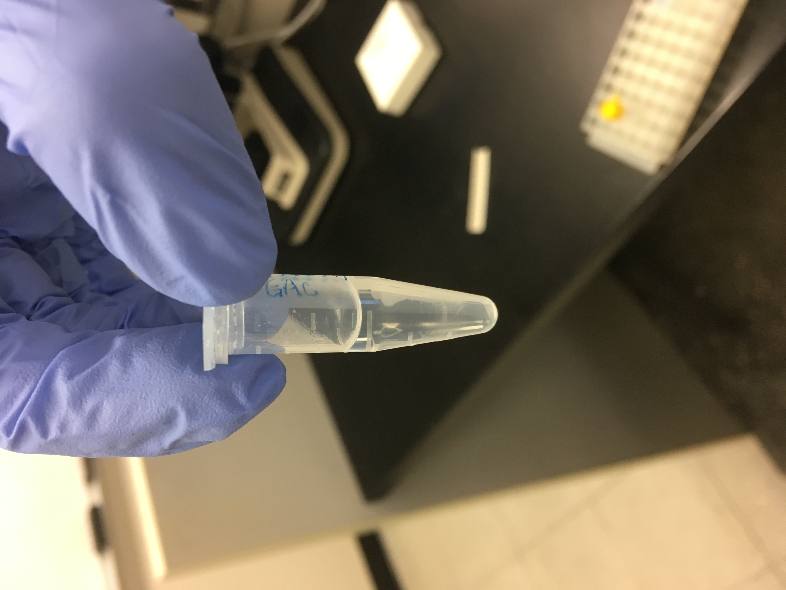
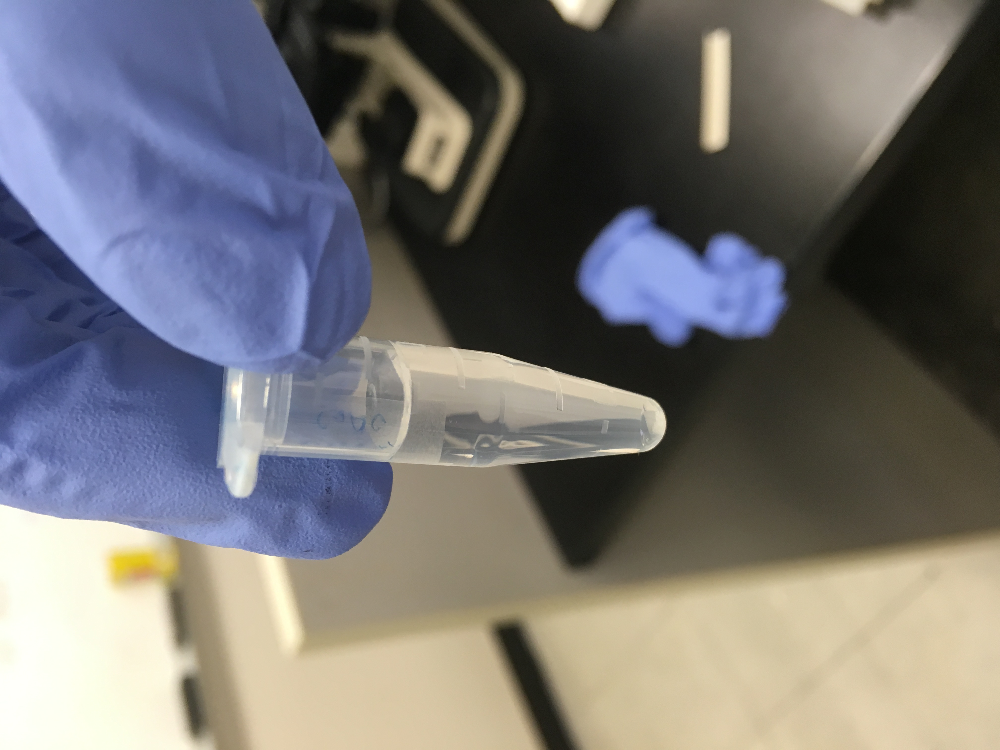
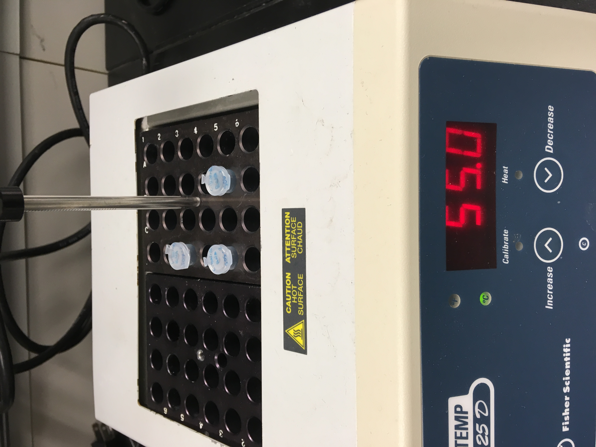

Today I tried out the Trizol LS Reagent extraction on three samples from Day 26. I used 1ul of each sample to run on the Qubit (RNA High Sensitivity), and all three samples were "out of range". Images and more details in the post below:

## What I did today:
Post from Monday detailing the protocol: [here](https://grace-ac.github.io/Centrifuge-error-3-fail-extraction/)

Due to the centrifuge that was originally in the 4C in FTR 213 [not working](https://github.com/RobertsLab/resources/issues/542), I put the one that's usually in 209 into the fridge. I gave it a bit over an hour to acclimate to the temperature in there. 

I then followed the protocol detailed in the post linked out above - which was just taken from the [Trizol LS Reagent manual protocol](https://github.com/grace-ac/grace-ac.github.io/blob/master/notebook-images/TrizolLS-protocol-manual.pdf). 

The samples I used were from Day 26:      

After Step 3 of the Lyse Samples and Separate Phases section, the clear supernatant was supposed to be at the top, but in all three tubes, the pink Trizol was floating on the top:    

I did my best to discard the pink Trizol and then transfer only the clear liquid to a new tube, but it was tricky. They all were slightly pink at the top:    

After Ste 7 in the "Lyse samples and separate phases", the samples appeared to have the three phases described in the protocol: a lower red (wasn't red) phenol-chloroform; an interphase; and a colorless upper aqeous phase:    

Here's what it looked like after I added the 500ul of isopropanol to the samples in Step a of the "Precipitate the RNA" section:   

Then, after Step c of "Precipitate the RNA" section (centrifuge 10 mins at 12000g), the samples were supposed to have a white gel-like pellet that contains the RNA at the bottom of the tube. I didn't really see anything, but I continued with the protocol as though there were a pellet at the bottom:     

Then, after Step b of "Wash the RNA" section (vortex and centrifuge) the samples appeared to have small bubble-looking pellets at the bottom... (?)            

For Step a of the section "Solubilize the RNA", I added 20ul of 0.1% DEPC-treated H20. 

For Step b of the section "Solubilize the RNA", I put the samples on a heat block set to 55C for 12 minutes:    

### Qubit results were all: "Out of Range" (I used 1ul of sample)
This could mean a number of things:     
- there was no RNA in the sample to begin with       
- there was RNA in the sample, but the protocol didn't work (I could have messed up somewhere OR maybe this isn't the right kind of protocol for the sample we have)
- the extracted RNA in the sample was too low to detect: there could have been some RNA, but the Qubit may not have been able to detect it. Seems less likely to me because the reagents I used were designed to be highly sensitive. 

### Not sure what next steps are... I guess I could try it again with a few more samples... or we could just decide to go with the Qiagen RNeasy Kit that [I've used](https://grace-ac.github.io/Pool-RNeasy-DecaPod-S1E13/)  (though the [Bioanalyzer results](https://grace-ac.github.io/bioanalyzer-results/) were less than comforting). Will confer with Steven and Sam to see what makes most sense. 

