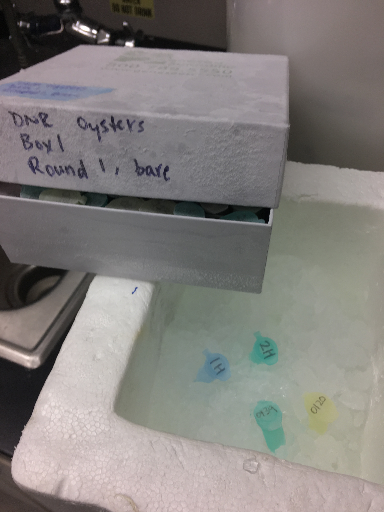
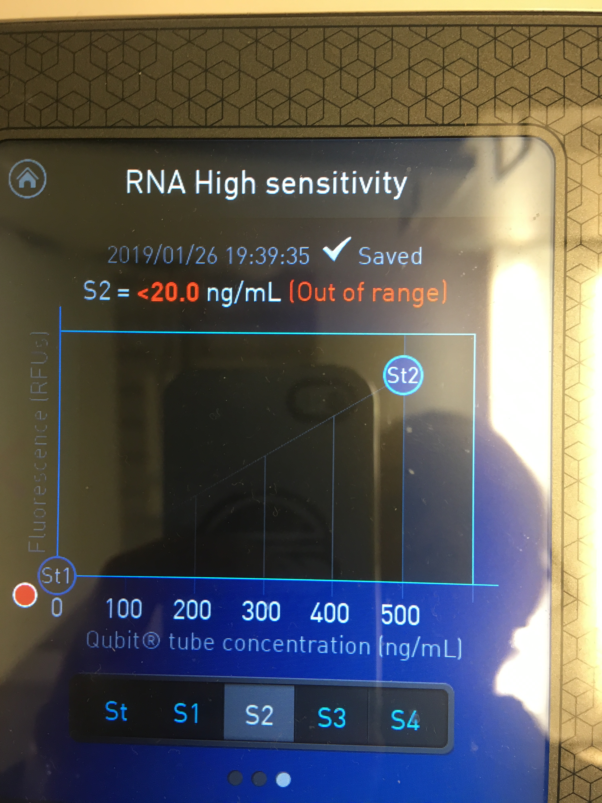
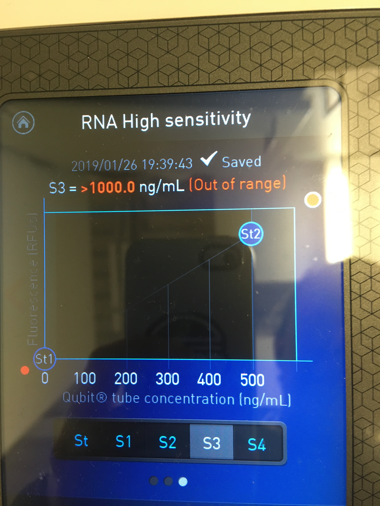

Today I also tried the Qiagen RNeasy Micro Plus Kit on geoduck (_P. generosa_) hemolymph (2 samples) and oyster (_C. viriginica_) tissue (2 samples). 

## What I did today:   
Samples used:    

The geoduck hemolymph (1H and 2H) are the same from what I used in my [Trizol LS Reagent test](https://grace-ac.github.io/trizol-with-geo-and-oyster/). I used 250ul of each sample for the Qiagen RNeasy Extraction. 

The oyster tissue samples 0120 and 0139 are from Yaamini's DNR project. I used the whole tissue sample, and after adding the 2-ME and Buffer RLT mixture, I homogenized the samples using blue plastic mini pestles. 

Protocol: [page 1](https://github.com/grace-ac/grace-ac.github.io/blob/master/notebook-images/012619-rneasykit-test/RNeasy-protocol-1.jpg); [page 2](https://github.com/grace-ac/grace-ac.github.io/blob/master/notebook-images/012619-rneasykit-test/RNeasy-protocol-2.jpg)

I used 10ul of 2-ME per sample, with 1mL of Buffer ATL in step 1. 

During steps 5-7, I centrifuged at 10,000 rcf for 30s. Tube 0139 (oyster tissue) always had some extra liquid in the spin column, but it all got spun through after the 2min centrifuge at 10,000rcf after step 7. 

Eluted samples with 14ul of RNase-free water (provided in kit).

### Qubit results (used 1ul of sample):

The geoduck hemolymph samples were "Out of range TOO LOW". Here's what the graphs looked like for both hemolymph samples:   

The oyster tissue samples were "Out of range TOO HIGH". Here's what the graphs looked like for both tissue samples:   

### Next steps:    
Not sure if I should spend the time to bioanalyze the oyster tissue samples from this extraction as well as from the [Trizol LS Reagent Extraction](https://grace-ac.github.io/trizol-with-geo-and-oyster/)... 

I'll create an issue to see what next steps should be. 

But it could just be that there wasn't geoduck hemolymph in the samples I used today. I used the same sample tube for both extractions... The other one she offered had much too small of an amount of hemolymph for me to use for either extraction. 
