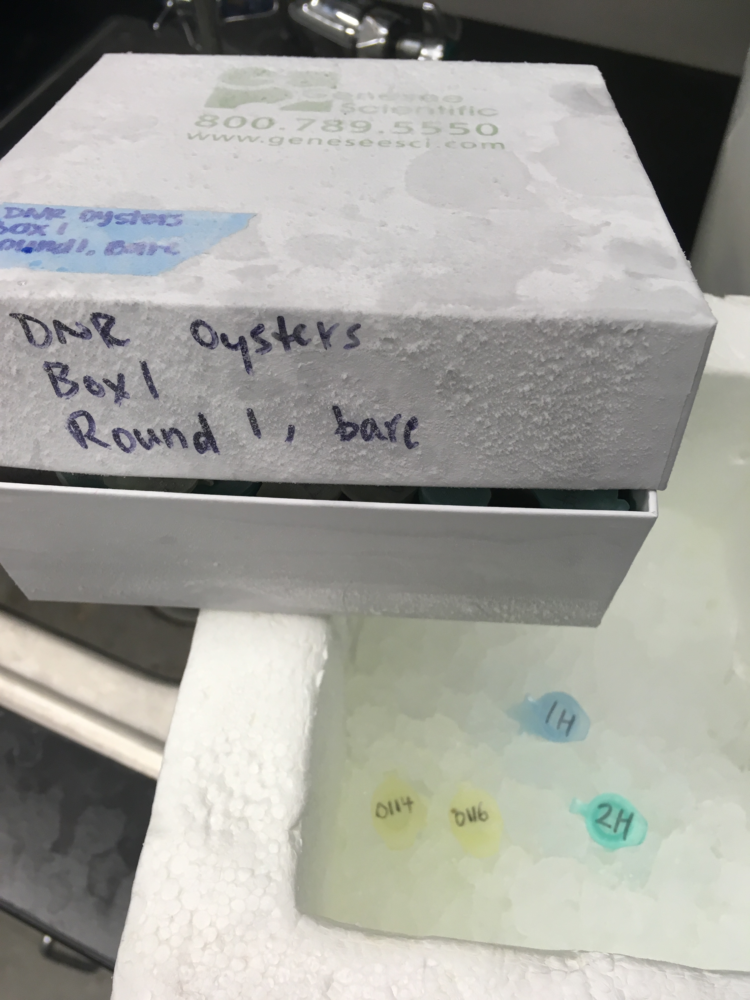
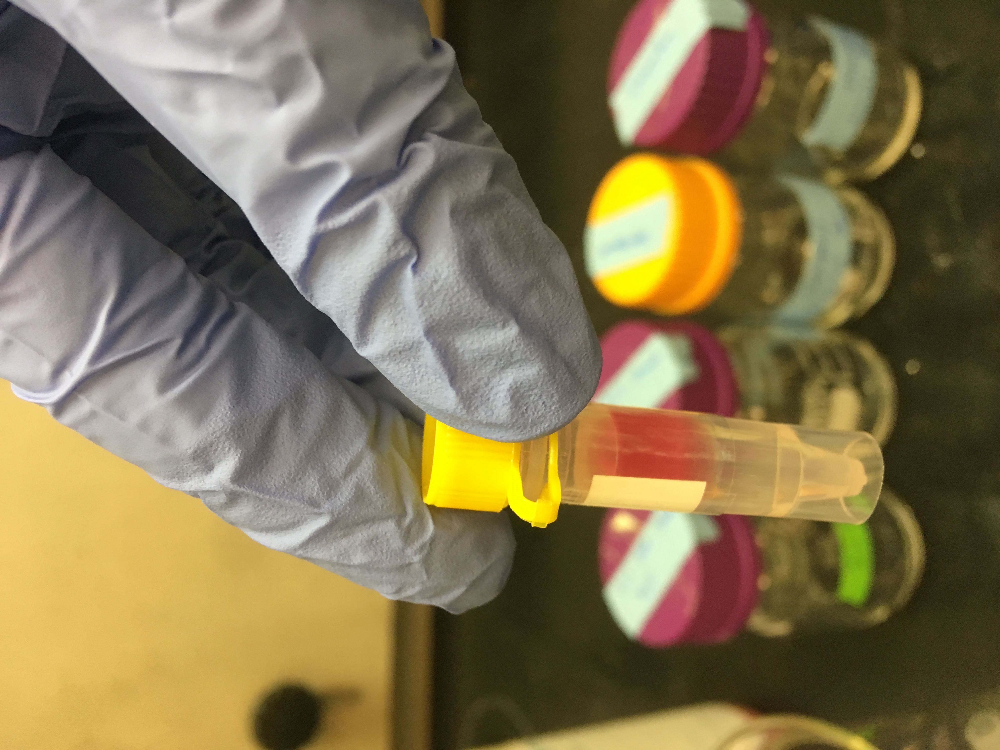
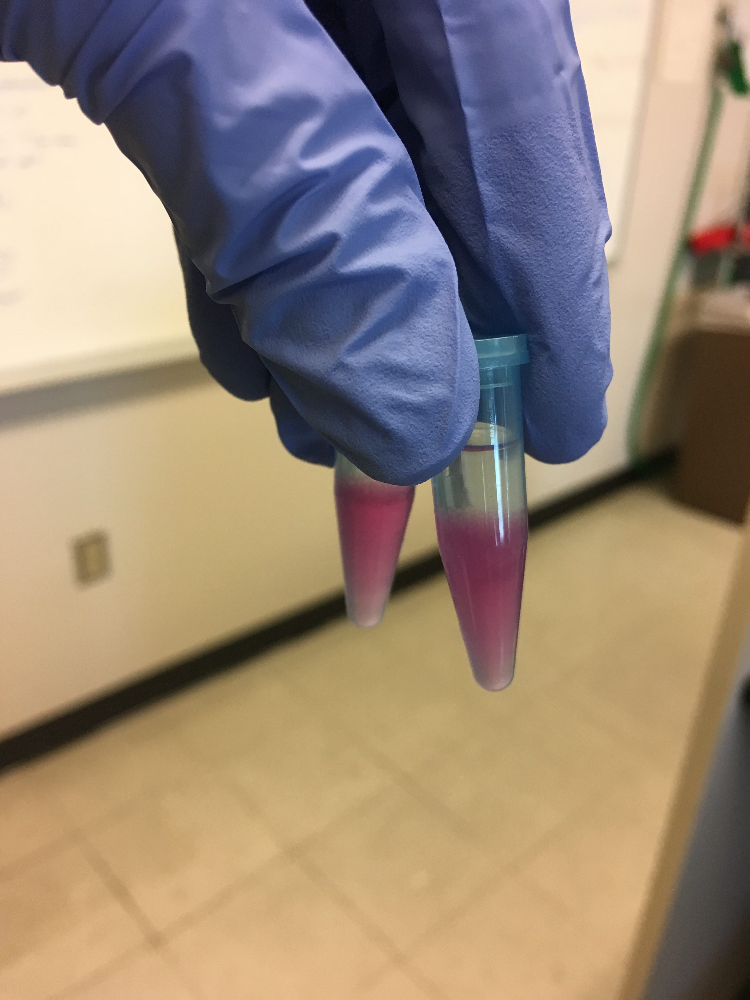
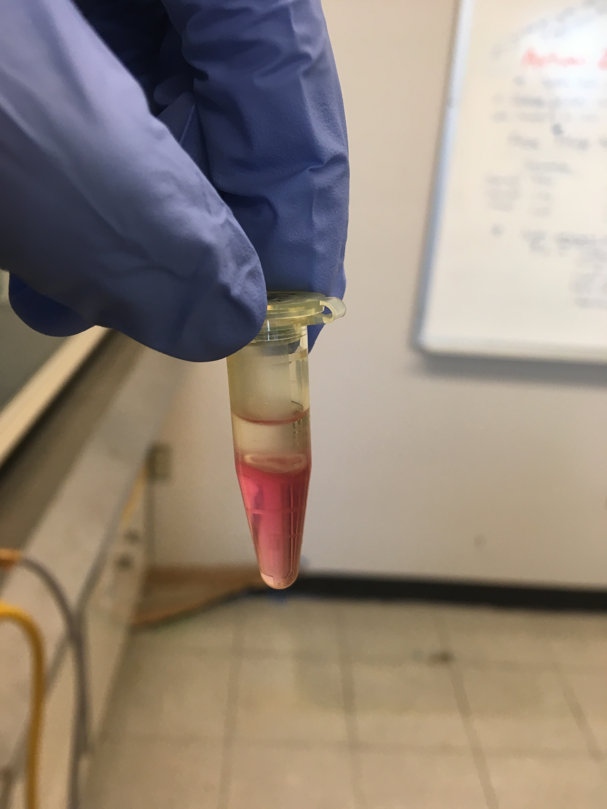
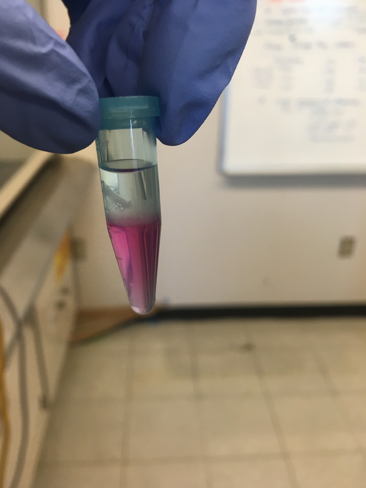
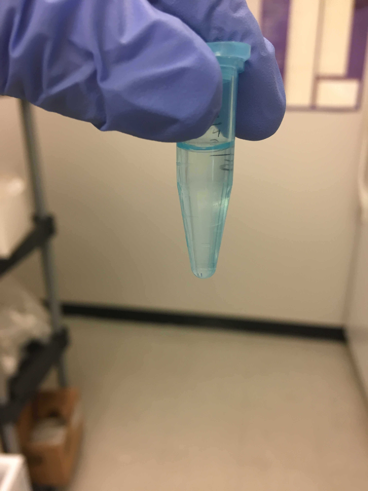
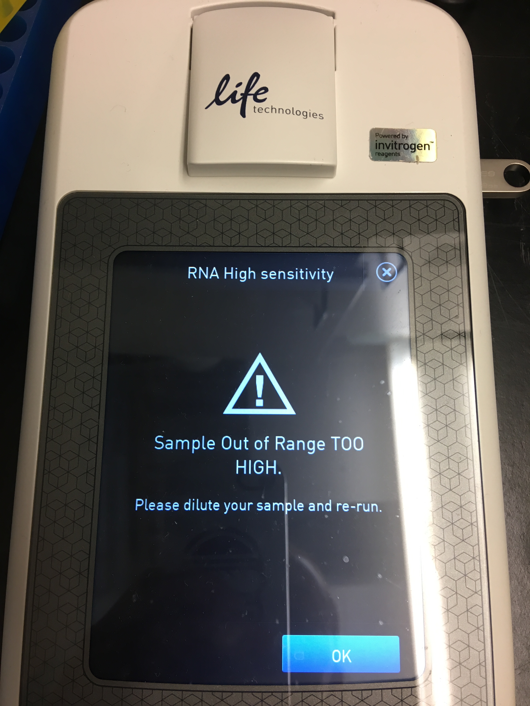

Today I tried out the Trizol LS Reagent RNA extraction protocol on two geoduck (_P. generosa_) hemolymph and two oyster (_C. virginica_) tissue samples. (GitHub Issue [#533](https://github.com/RobertsLab/resources/issues/553))

## Note (01/28/2019): Trizol LS (liquid sample) reagent was not designed to be used with tissue samples. ([GitHub Issue #555](https://github.com/RobertsLab/resources/issues/555))

## What I did today:
The samples I used (from this [GitHub Issue](https://github.com/RobertsLab/resources/issues/554)):    

The DNR samples are the oyster tissue samples (0114 and 0116) from Yaamini's old project.    
The geoduck hemolymph samples (1H and 2H) are from when Shelly was trying things out with some geoduck that were kept here at SAFS.

I followed the [same protocol](https://grace-ac.github.io/Centrifuge-error-3-fail-extraction/) as I did for the crab hemolymph, with a few modifications. 

I pipetted out 250ul of hemolymph for the geoduck samples, and used the whole tissue chunk (very small) for the oyster samples. I squished them around a little with the tip of the pipet. Probably should have used one of those tiny blue plastic pestles to smush the oyster tissue up. 

After adding the Trizol LS Reagent to the samples and centrifuging them, there was no separation into a supernatant. They all looked like this:          
   

The crab samples looked like this after that same step:      
    

So, instead of transfering any clear supernatant to a new tube (there wasn't any for these samples), I just moved on and added 200ul of chloroform to each sample, vortexed, let incubate at room T for a couple mins, then centrifuged. 

After the samples were left to incubate after the addition of chloroform, there was already some separation:   

After centrifuge step with the chloroform they looked like this:   
Oyster tissue:    
    
Geoduck hemolymph:     

After the addition of isopropanol, incubate at room T, and centrifuge, they all looked like this (not an obvious white gel-like pellet at the bottom... but I continued as though there were one):    

The rest of the protocol was pretty much the same, except that I forgot to heat up the heat block earlier, so they waited at room temp for about 5 mins before they incubated at 55C. 

### Qubit Results (google sheet [link](https://docs.google.com/spreadsheets/d/1qmAQoS5FmPo1h0d2qMuJaUDUAICYJdzT2NC2aJRtQNA/edit#gid=0)):   
Used 1ul of sample for quantification.     
There was no detectable RNA in either of the geoduck hemolymph samples.    

There WAS a lot of detectable RNA in one oyster tissue sample, and too much in the other. The Qubit screen was this for the one that was too high:    

### Next move:   
Try out the geoduck hemolymph and some oyster tissue samples using the Qiagen RNeasy Plus Micro Kit

Bioanalyze all samples that had detectable RNA based on Qubit results
