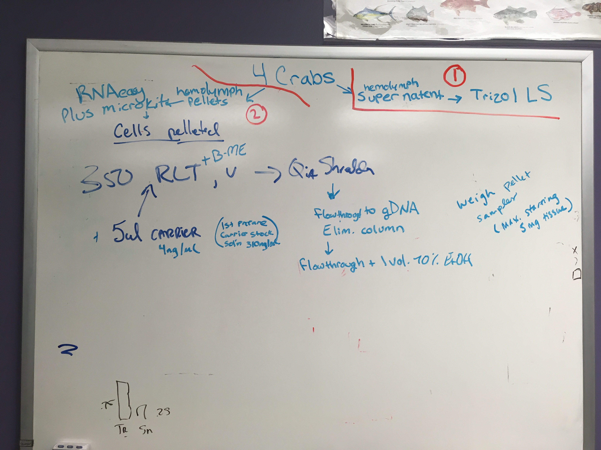
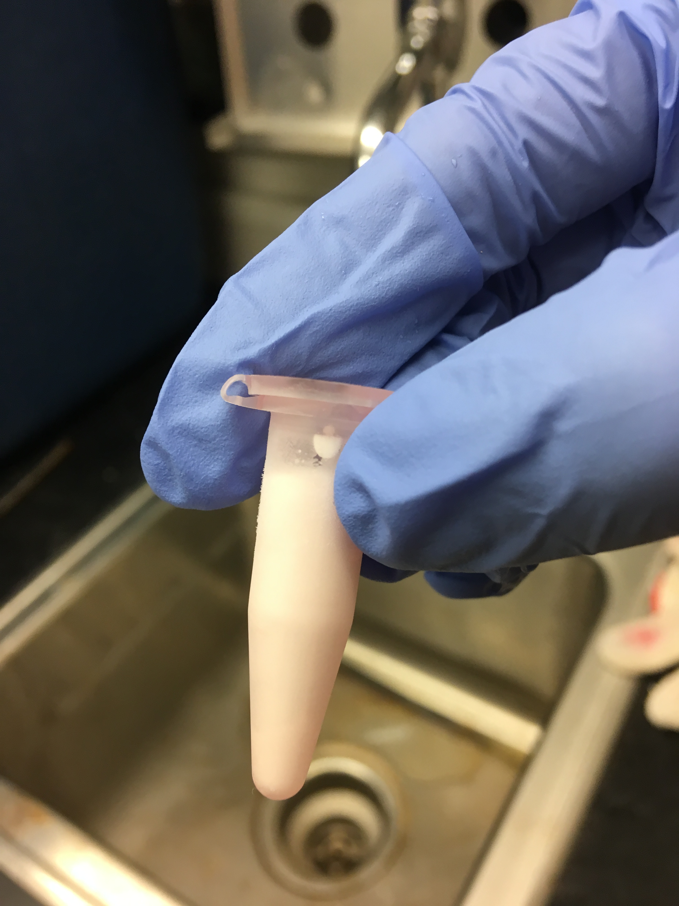
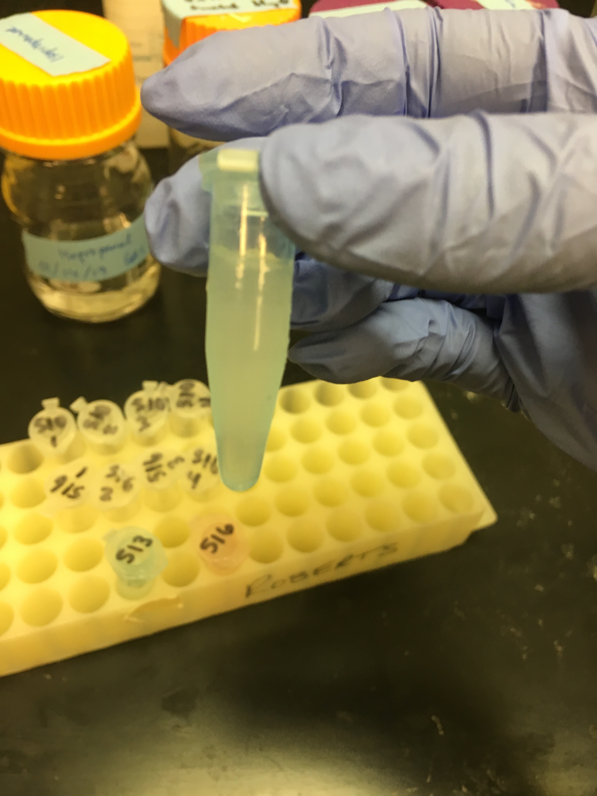
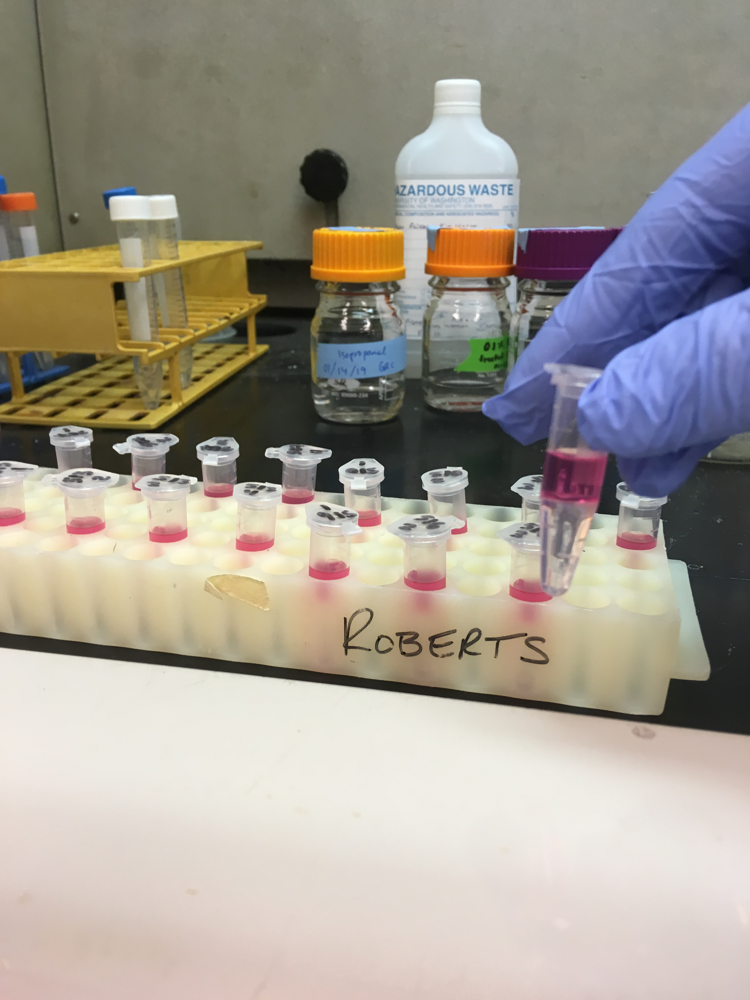
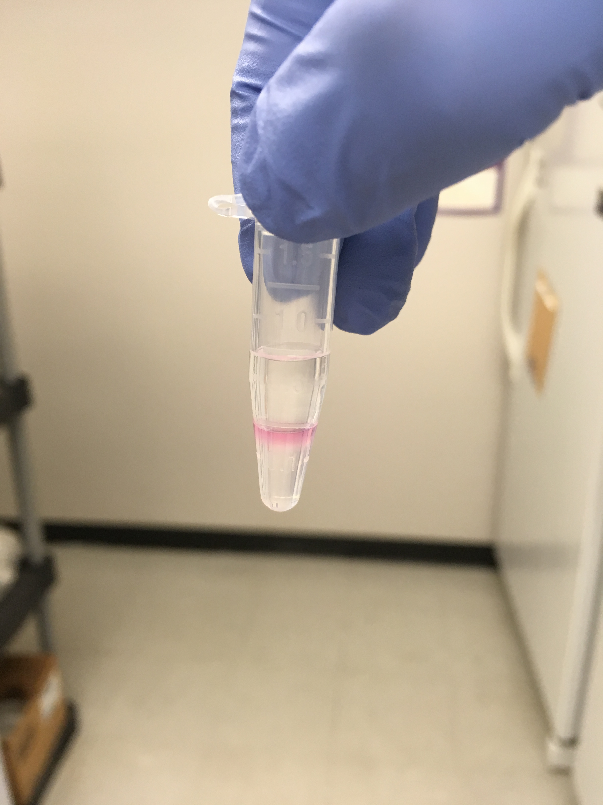
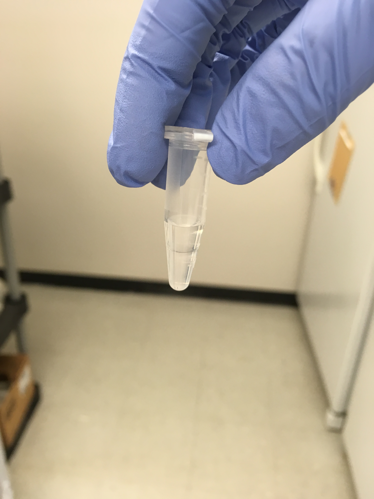
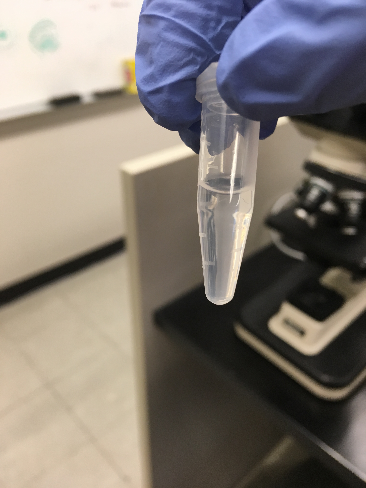
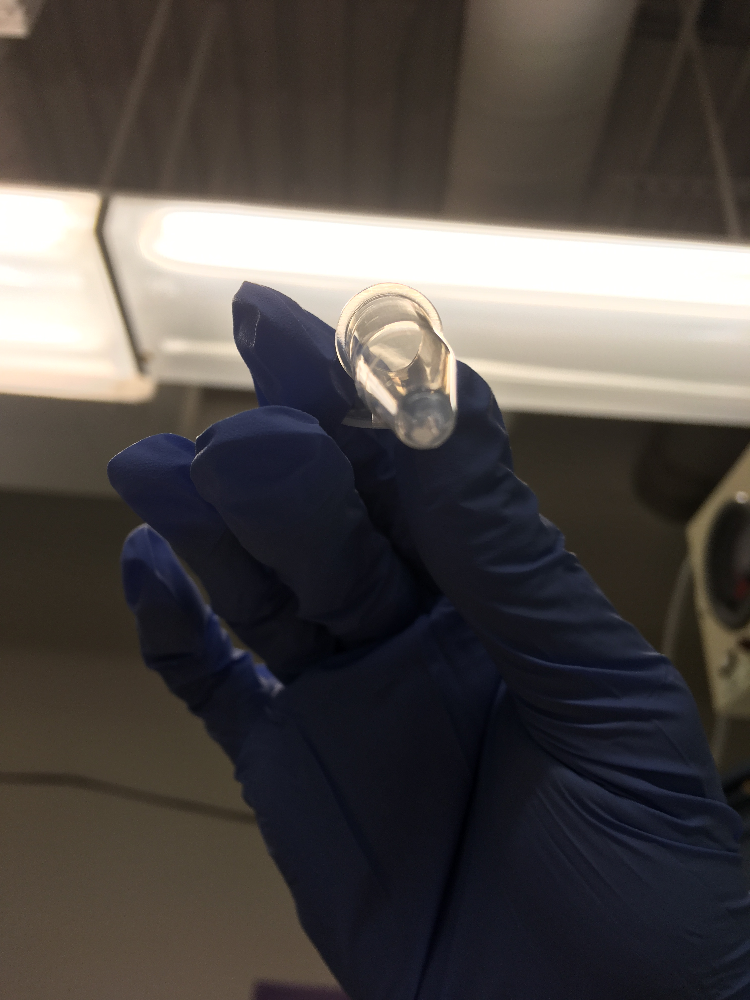

After talking with Steven and Shelly, today we decided I should attempt to extract RNA from supernatant samples using the Trizol LS protocol. This post contains the steps that I performed with pictures of some steps, and results (no RNA in final samples :(...). Overall current plan is to take 4 crabs from Day 26. Use Qiagen RNeasy Kit with QIA shreddercolumn and RNA carrier on the pellets, and use Trizol LS on the corresponding supernatant samples. 

### Here's what Steven, Shelly and I identified as the current plan:     
    

Use 4 crabs from Day 26 - making sure that the crabs chosen have 2/3 sample tubes left (some crabs from day 26 only have one tube left!!)     

Use Trizol LS to attempt to extract RNA from the supernatant from those 4 crabs. (**ATTEMPTED THIS TODAY- DETAILS BELOW**)         

Use Qiagen RNeasy Kit with QIAshredder columns for homogenization, and use RNA carrier on the pelletted samples from those 4 crabs. 

If there is RNA in supernatant, we could combine pellet and supernatant to get higher yields of RNA per sample... ([GitHub Issue with Crab Project Next Steps](https://github.com/RobertsLab/resources/issues/577)). 

### Preparation before protocol:  
Selected 4 samples from Day 26 that still had 2/3 samples left per crab. The samples selected were:   
507    
510     
513     
516     

Today I only used the supernatant (RNAlater), which looked like this in the -80:     

I let the samples thaw. Samples were pretty thick and almost gel-like in consistency:      

Each tube contained ~1.5ml of supernatant. To keep the ratios simpler, I separated the samples into four tubes, so that each sample was now 4 tubes of 250ul of supernatant each (16 tubes total).     

### Protocol Part 1: Lyse samples and separate the phases (link to manufacturer protocol: [here](https://github.com/RobertsLab/resources/blob/master/protocols/Commercial_Protocols/Invitrogen_trizol_ls_reagent_January2019.pdf)):    

1. Add 750ul of TRIzol LS reagent to each tube     
2. Homogenize by pipetting up and down (5x)     
3. Centrifuge 5mins at 12,000 g at 4C. Transfer clear supernatant to new tube. (This step isn't necessary, but while I was doing the protocol, I couldn't remember if we decided to do it or not... so I just did it. **Question: maybe I should try protocol again without this step? Maybe I'm losing RNA during the transfer step?**)    
After the centrifuging in step 3, all samples looked like this:     
     

So before I went on, I did my best to discard the pink layer and only transfer the clear part to a new tube. Then I continued:    

4. Incubate for 5 mins 

5. Add 200ul of chloroform.

6. Incubate for 2-3 mins. 

7. Centrifuge samples for 15mins at 12,000 g at 4C. After this, the samples should separate into three phases: a lower red phenol-chloroform, interphase, and an upper colorless aqueous phase.     
Here's what some samples looked like that I wasn't able to avoid transfering over the pink in step 3:     
     
Here's what some samples looked like that I was able to only transfer the clear in step 3:    
    

8. Transfer the aquaous phase containing the RNA into a new tube.    
During this step, the volumes that were transfered for each sample weren't equal. For one of the tubes from sample 516, I accidentally discarded about 200ul of the aqueous phase... but was able to transfer a little less than 200ul afterwards because there was still some left. **Question: should I have aimed to transfer the same volume for each tube?**

### Protocol Part 2: Isolate RNA
#### Step 1: Precipitate the RNA
1. Add 500ul of isopropanol       
2. Incubate for 10 mins        
3. Centrifuge for 10 mins at 12,000 g at 4C. Total RNA forms a white gel-like pellet at bottom of the tube.      
I couldn't see any gel pellets, but I continued the protocol as though there were some:     
      
4. Discard supernatant.      

Some notes on this section:    
During this part, I posted an issue on GitHub ([#581](https://github.com/RobertsLab/resources/issues/581)) asking when I should recombine the 4 tubes into one sample. Sam suggested I do it during the precipitation section by centrifuging 1 out of the 4 tubes, discarding the supernatant, and then adding the contents of the second tube of the four to that first tube, centrifuge, and discard the supernatant, and so on.     
Before seeing that Steven suggested I talk to Shelly as well, I started doing what was suggested and centrifuged 1 out of 4 of each of the samples.     
While those 4 were in the centrifuge, Shelly and I talked and she made the point that all of the volumes in the remainder of the protocol are based on the initial volume of Trizol LS used (in this case, 750ul per sample). By combining 4 tubes into 1 sample, I'd then have to quadruple all the volumes of the remaining reagents for the rest of the protocol, so instead we decided it would be easier to combine samples during the solubilization step of isolating RNA (will describe later).    
As a result of what's stated above, 12 of the samples incubated at room temperature for 20 mins, and the four samples that I first centrifuged sat at room temp (with superantant still in tubes) for 10mins after centrifuging...     

#### Step 2: Wash the RNA
1. Resuspend (by pipetting up and down) the pellet in 1ml of 75% ethanol.     
2. Vortex briefly (3 s), then centrifuge for 5mins at 7500g at 4C.     
3. Discard supernatant.     
4. Air dry pellet for 5-10 mins.     

Some notes on this section:     
I was able to see something at the bottom of all the tubes - a grey-ish white pellet of something:    
    

During the drying step, I discarded the supernatant and left the samples to dry for 10 mins. When I looked at them after 10mins, I realized there was still too much liquid, so I used a smaller pipet to pull off more supernatant and then let them air dry for 10 more mins... Not sure if this was a bad idea.    

#### Step 3: Solubilize the RNA
1. Resuspend the pellet in 20ul of RNase-free water - I used 0.1% DEPC-treated water.     
2. Incubate on a heat block at 55C for 15 mins.    

Some notes on this section:    
For the resuspension, I did what Shelly and I discussed and used this step to recombine the 4 tubes for each sample into 1. I did this by starting with one of the 4 tubes, adding 20ul of RNase free water, pipetting up and down to resuspend pellet, then sucked it all up into the pipet tip, and deposited it in the second of the four tubes. Then I pipetting up and down to resuspend that second pellet, increased the volume on the pipet tip so that I could transfer the whole sample, and desposited it in the third of the four tubes... and so on. By the end of the resuspensions, each sample tube ended up with somewhere between 24 and 25 ul.    

### Results: No RNA
I ran 1ul of each sample on the Qubit using RNA High Sensitivity reagents. Unfortunately, none of the samples had any detectable RNA. They all said "Out of Range: TOO LOW".      

I saved the samples anyway, and put them in my RNA extraction protocols test box in the -80 (Rack 5, column 4, row 3). 
