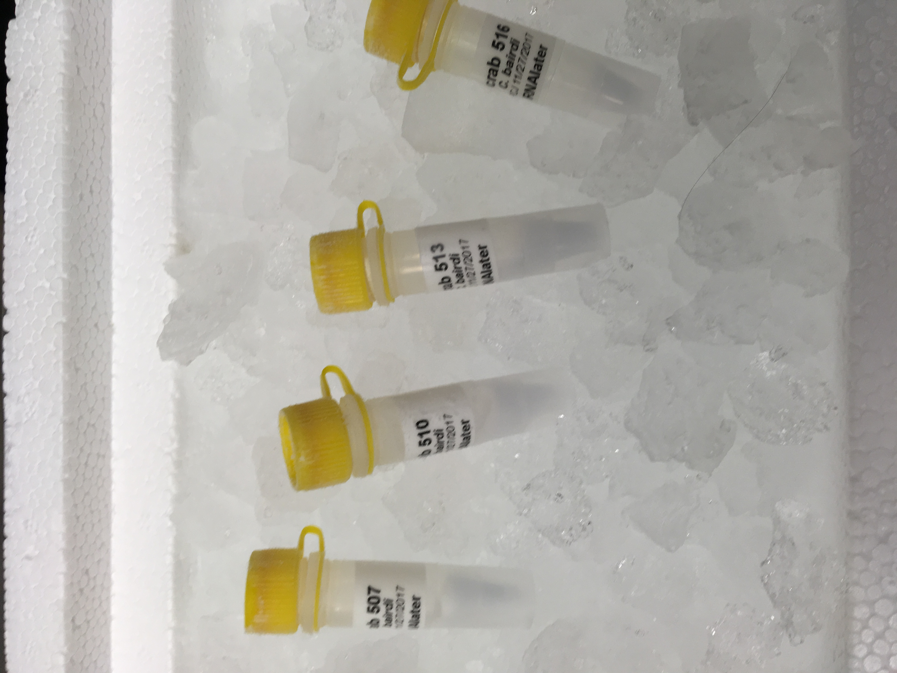
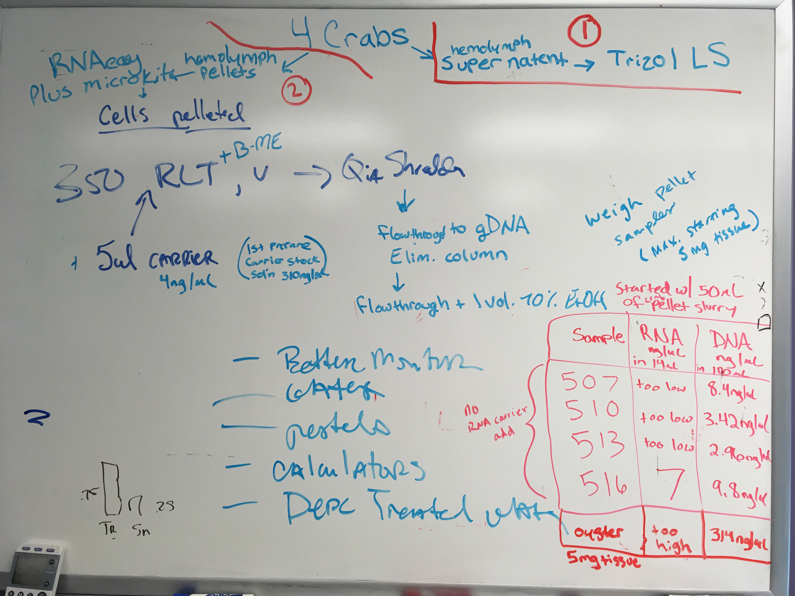

Today, Steven, Shelly, and I worked together on extracting RNA from bairdi hemolymph pellets using the Qiagen RNeasy Micro Plus Kit with QIAshredder columns to aid in homogenization. Instead of using the whole pelleted sample like I have always done in the past, we let it thaw at room temp, centrifuged at full speed for ~30s, then sampled out 50ul of the hemolymph/RNAlater slurry into new tubes. The reasoning for this is to see if maybe using the whole tube contents resulted in clogging the spin column tubes. Shelly also saved the DNA that got caught on the gDNA spin column, washed, and eluted to quantify DNA using the Qubit DNA Kit. This was to check to see if there was any DNA in the samples. All four had relatively low amounts of DNA, and only one of the four had quanitifiable RNA (rest were TOO LOW (less than 5ng/ul). Next steps are detailed at end of post. 

### Prep before protocol
#### Samples
We used the corresponding pellets from my supernatant extractions:     
507-2       
510-2      
513-2      
516-2     

**These tubes are the second out of three.**

Steven let them thaw to room T, centrifuged at full speed for ~30s, then pipetted out 50ul of each sample into a new labeled, RNAse free tube (from RNA station by Sam's desk). I put the original tubes containing the rest of the samples back to their spot in the -80.      

#### Solutions:    
I made a solution of B-ME + Buffer RLT Plus for my four samples in a falcon tube from the RNA station.      
2mL Buffer RLT Plus      
20ul B-ME        

I made 70% ethanol using a serological pipet and the ethanol and 0.1% DEPC-treated H20 in a falcon tube, all from the RNA station.       
7mL ethanol      
3mL DEPC-H20      

**NOTE: I should have also made 80% ethanol. I had to go take a midterm, so Steven and Shelly carried on the protocol after step 3 of protocol.**

I also put 1ml of RNase-free H20 in the Carrier RNA and let it sit at room T for a bit. We decided not to use it, so I put it in the -20C in 209 (labeled lid with date and my initials). This can now act as a stock solution to make dilutions from for future use.    

### Protocol
1. Added 350u of the B-ME Buffer RLT plus solution to each tube
2. Vortex
3. Homogenize by putting lysate into QIAshredder columns. Centrifuge for _____ at full speed. 
4. Transfer homogenized lysate (in collectin tube) to gDNA spin column. Centrifuge for ____ at full speed. Keep column to check to see if there's DNA (more on this later), and KEEP THE FLOW THROUGH. 
5. Add 350ul of 70% ethanol to flow-through. Pipet to mix.
6. Transfer sample to RNeasy MinElute column. Close lid. Centrifuge for ____ at full speed. Discard flow-through.
7. Add 700ul of Buffer RW1 to RNeasy MinElute spin column. Close lid. Centrifuge for ____ at full speed. Discard flow-through.
8. Add 500ul Buffer RPE to RNeasy MinElute spin column. Close lid. Centrifuge for ___ at full speed. Discard flow-through. 
9. Add 500ul of 80% ehtnaol to RNesay MinElut spin column. Close lid. Centrifuge for ____ at full spind. Discard collection tube and flow-through. 
10. Place RNeasy MinElute column in new 2ml collection tube. Open lid of spin column and centrifuge for ___ at full speed. Discard collection tube with flow-through. 
11. Place RNeasy MinElut column in a new 1.5ml collection tube. Add 14ul RNase-free water (aliquoted tubes from -20) directoly to center of the column membrane. Close lid. Centrifuge for ___ at full speed to elute RNA. 

Then run 1ul of sample on Qubit using the Qubit RNA High Sensitivity reagents. 

### gDNA spin column
Shelly's comment on my [GitHub Issue](https://github.com/RobertsLab/resources/issues/577) describes how to save the DNA from the gDNA spin column. I'll have to ask to see if she followed these ratios. She eluted DNA and then ran the DNA on the Qubit using the DNA reagents. 

### Results:   

I placed the RNA tubes in the -80 in my protocol testing box (rack 5, column 4, row 3). 

### Notes
Qubit was done using 1ul of sample. 

While this protocol was being performed, Laura and Alanna were both working on oyster tissue using the same protocol with 5mg of ground up oyster body. Their results are below mine. With the same protocol, they got RNA that was above the maximum detection limit for the Qubit RNA HS kit, and also got high DNA from their sample. 

The crab hemolymph had relatively low DNA in all four samples, and only had RNA (7ng/ul) in sample 516-2. 

There could be RNA in 507, 510, 513, but it might be too low to detect (less than 5ng/ul) and those samples may have required more than 50ul of the pellet in order to extract RNA. 

### Next steps
After I got back from my midterm, I saw the results of what happened while I was gone. Steven, Shelly and I talked and decided the next logical step is to run this kit again using more of the pelleted hemolymph from tube 516-2 (because we know that there is RNA in there). 

I will use 4 volumes of that pellet:    
10 ul    
50 ul    
100 ul    
150 ul    

If there isn't enough to do all four, then I'll just do 10, 50, 100 ul. 

I will thaw the sample, **but I'm not sure if I should centrifuge it, too?** Maybe I could just vortex? 
