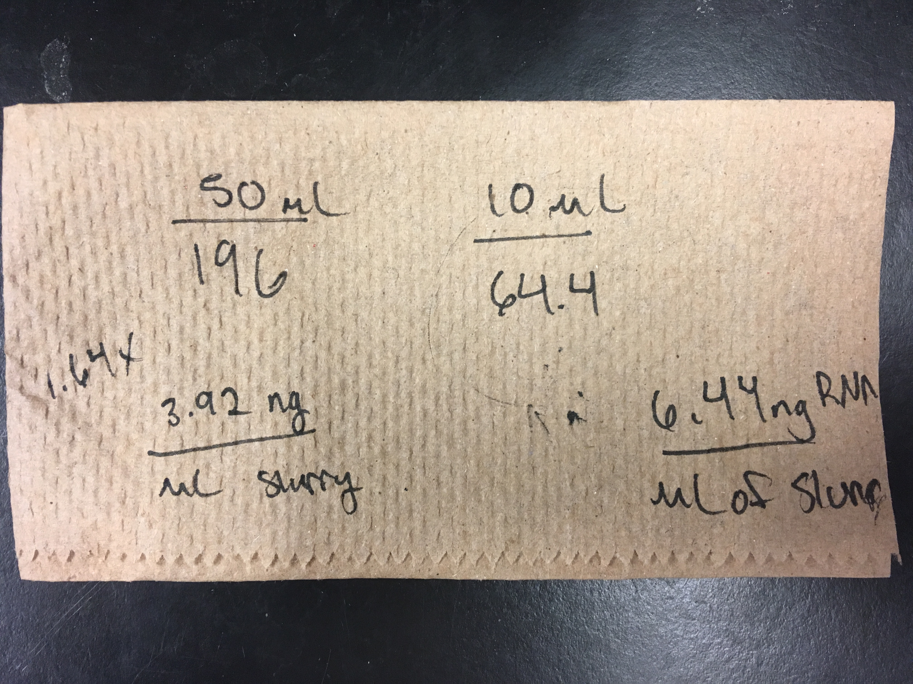

Today I extracted RNA from tube 516-2 in two different volumes: 10ul and 50ul. The tube only had about 62ul of sample slurry remaining, so I was only able to do 10ul and 50ul. I used the same protocol as what Steven and Shelly did last Friday. I saved the gDNA and eluted it to get the DNA concentration from the samples, and also got the RNA Qubit results. There was RNA in both, and DNA in both. When comparing the amount of RNA extracted to the amount of starting material, there is higher yield when using 10ul of sample than the 50ul of sample. More notes detailed in post.

### Prep before extraction
Made 70% ethanol    
Made 80% ethanol    
Made Buffer RLT Plus and B-ME solution (originally for four samples- I thought I was going to have more 516-2 slurry left over)   
2 mL Buffer RLT Plus     
20ul B-ME

### Protocol
1. Added 350ul of Buffer RLT Plus + B-ME solution to both samples      
2. Vortex to mix     
3. Transfer lysate to QIA Shredder column with 2ml collection tube. Centrifuge 2min at full speed        
4. Transfer flow-through to gDNA Elimninator column with 2ml collection tube. Centrifuge for 30s at 12,00 g. Discard column. Save flow-through. Also save gDNA column for later use.     
5. I measured the amount of flow-through for both samples and added that same volume's worth of 70% ethanol. THe 10ul starting material sample had 340ul, so I added 340ul of 70% ehtanol. The 50ul sample had 345ul, so I added 345ul of 70% ehtanol. *Mix by pipetting*.    
6. Transfer sample (including any precipitate that may have formed) to RNeasy MinElute column. Close Lid. Centrifuge 20s at 12,000g. Discard flow-through    
7. Add 700ul Buffer RW1 to RNeasy column. Close lid. centrifuge 20s at 12,000g. Discard flow-through.    
8. 500ul Buffer RPE to RNeasy column. Close lid. Centrifuge 20s at 12,000g. Discard flow-through.   
9. Add 500ul 80% ethanol to RNeasy column. Close lid. Centrifuge 2min at 12,000g. Dsicard collection tube and flow-through.    
10. Put RNeasy column in new 2ml collection tube. Cut off RNeasy column lid. Keep tube open and centrifuge at full speed for 5min. Discard flow-through.    
11. Put RNeasy column in new 1.5 ml collection tube. Add 14ul RNase-free water (from red-capped aliquotted tube) to center of membrane (I missed the center for the 50ul sample). I forgot to close lid, so the tubes were centrifuged open for 1min at full speed.    

DNA elution     
    

### Results
RNA     
[Google sheet](https://docs.google.com/spreadsheets/d/199UslkXFKOcokjJMFOIbyyis8-gfLpMsdSFdDY_zKQA/edit#gid=0)    

10ul starting sample volume --> eluted 14ul RNase-free water --> ran 1ul on Qubit RNA HS --> 4.6ng/ul     
50ul starting sample volume --> eluted 14ul RNase-free water --> ran 1ul on Qubit RNA HS --> 14 ng/ul    

When comparing the starting material volume to the RNA yield, you get more RNA from the 10ul starting sample volume.    

Shelly's napkin notes:    
   

DNA    
[Google sheet](https://docs.google.com/spreadsheets/d/1-InYE-bLjpTue923mHl_l2mgc8Fa8j5vWDBhvg-o3GA/edit#gid=0)      
10ul starting sample volume --> eluted in 100ul Buffer AE --> ran 1ul on Qubit BR DNA --> 2.28ng/ul     
50ul starting sample volume --> eluted in 100ul Buffer AE --> ran 1ul on Qubit BR DNA --> 12.9ng/ul     
